# Research: Project 3 - Marketing Ops Automation

**Date**: 2025-12-20T01:56:36+05:30  
**Researcher**: Claude AI Assistant  
**Git Commit**: [c1d8705](https://github.com/sciencenerd-des/Resume_Projects/blob/c1d8705ca8d11ff205756d27367c95763cf2f4be)  
**Branch**: main  
**Repository**: [Resume_Projects](https://github.com/sciencenerd-des/Resume_Projects)

---

## Research Question

Document the current state, specifications, and implementation requirements for Project 3 of the Growth Lead Portfolio, as defined in the [project_constitution.md](file:///Users/biswajitmondal/Developer/project_profile/project_constitution.md).

---

## Summary

Project 3 is the **third pillar** of the Growth Lead Portfolio, designed to demonstrate **operational efficiency** through marketing automation. The project focuses on building a **lead processing pipeline** using **n8n** (a low-code/no-code automation platform) to eliminate manual bottlenecks in growth operations.

### Current State
- **Directory**: `/Project_3/` exists but is currently **empty**
- **Status**: Not yet implemented
- **Dependencies**: None currently in place

### Strategic Purpose
This project proves that a candidate can:
- Scale growth operations through automation
- Build "pipes" that enable fast team execution
- Remove manual bottlenecks via low-code orchestration

---

## Detailed Findings

### Core Objective
The project addresses the **operational bottleneck** that growth teams face when processing leads manually. It demonstrates the ability to architect automated workflows that handle data ingestion, validation, routing, and reporting.

### Workflow Architecture (As Specified)

The constitution specifies a **5-stage pipeline**:

```mermaid
flowchart LR
    A[📥 Ingest] --> B[🔄 Transform]
    B --> C[✅ Validate]
    C --> D{Route}
    D -->|Valid| E[📝 Notion CRM]
    D -->|Invalid| F[📋 Error Log]
    E --> G[📧 Report]
    F --> G
```



| Stage | Purpose | Technical Implementation |
|-------|---------|-------------------------|
| **1. Ingest** | Read CSV file | Spreadsheet File Node (converts binary CSV to JSON) |
| **2. Transform** | Parse data into JSON | Built-in n8n transformation |
| **3. Validate** | Check email format | IF Node with RegEx pattern |
| **4. Route** | Conditional branching | Valid leads → Notion, Invalid → Log |
| **5. Report** | Stakeholder notification | Gmail node with summary stats |

### Technical Specifications

#### Email Validation Pattern
The RegEx pattern specified for the quality gate:
```regex
^[\w-\.]+@([\w-]+\.)+[\w-]{2,4}$
```

This validates:
- Alphanumeric characters with dots and hyphens before `@`
- Valid domain structure after `@`
- TLD between 2-4 characters

#### Notion API Integration
The constitution specifies JSON mapping for multi-select fields:

```javascript
// Code Node for parsing multi-select tags
const tags = items[0].json.Tags.split(',');
return tags.map(tag => ({ json: { name: tag.trim() } }));
```

#### Automated Reporting
Gmail node template format:
```
"Process complete. X leads added to CRM. Y leads rejected."
```
Where X and Y are dynamically calculated counts.

---

## Code References

| Reference | Location | Description |
|-----------|----------|-------------|
| Project Overview | [project_constitution.md:188-215](file:///Users/biswajitmondal/Developer/project_profile/project_constitution.md#L188-L215) | Full specification for Project 3 |
| Ingestion Step | [project_constitution.md:199-200](file:///Users/biswajitmondal/Developer/project_profile/project_constitution.md#L199-L200) | Spreadsheet File Node details |
| RegEx Validation | [project_constitution.md:202-203](file:///Users/biswajitmondal/Developer/project_profile/project_constitution.md#L202-L203) | Email validation pattern |
| Notion Integration | [project_constitution.md:205-211](file:///Users/biswajitmondal/Developer/project_profile/project_constitution.md#L205-L211) | API mapping code |
| Reporting | [project_constitution.md:213-214](file:///Users/biswajitmondal/Developer/project_profile/project_constitution.md#L213-L214) | Gmail notification template |

---

## Architecture Documentation

### Platform: n8n

**n8n** is an open-source, low-code automation platform that enables:
- Visual workflow building via drag-and-drop
- Self-hosting capability
- 400+ available integrations
- Custom JavaScript/TypeScript code nodes

### Required n8n Nodes

| Node Type | Purpose | Configuration |
|-----------|---------|---------------|
| **Spreadsheet File** | CSV ingestion | File path, encoding |
| **IF** | Conditional routing | RegEx validation |
| **Set** | Data transformation | Field mapping |
| **Notion** | CRM integration | API key, database ID |
| **Gmail** | Email reporting | OAuth credentials |

### Data Flow Model

```
CSV Input
    ↓
[Spreadsheet File Node]
    ↓
JSON Array of Leads
    ↓
[IF Node: Email Validation]
    ↓
    ├── TRUE  → [Notion Node: Create Record]
    │               ↓
    │           Lead ID
    └── FALSE → [Set Node: Log Invalid]
                    ↓
                Error Count
    ↓
[Gmail Node: Summary Report]
```

### Integration Requirements

| Service | Requirement | Purpose |
|---------|-------------|---------|
| **Notion API** | API Key + Database ID | Lead CRM destination |
| **Gmail API** | OAuth 2.0 credentials | Automated reporting |
| **n8n Instance** | Self-hosted or cloud | Workflow execution |

---

## Related Research

| Document | Path | Relevance |
|----------|------|-----------|
| Project 1 Research | (Not yet created) | India Acquisition Funnel |
| Project 2 Research | (Not yet created) | Experimentation Engine |
| Validation Report | [validation_report.md](file:///Users/biswajitmondal/Developer/project_profile/validation_report.md) | Overall project status |

---

## Open Questions

> [!NOTE]
> The following require clarification or future investigation:

1. **CSV Input Source**: Where will the lead CSV file originate?
   - Google Drive integration?
   - Local file upload?
   - Webhook trigger from form submission?

2. **Notion Database Schema**: What fields should the Notion CRM database include?
   - Lead name, email, phone?
   - Lead source, tags, score?
   - Status tracking?

3. **Error Handling Strategy**: How should the workflow handle:
   - API rate limits?
   - Network failures?
   - Duplicate lead detection?

4. **Hosting Environment**: 
   - Self-hosted n8n instance vs. n8n.cloud?
   - Docker deployment vs. bare metal?

5. **Additional Integrations**: Should the workflow connect to:
   - Slack for real-time notifications?
   - Google Sheets for backup logging?
   - Analytics for pipeline monitoring?

---

## Implementation Roadmap (Not Implemented)

> [!IMPORTANT]
> This section documents the planned implementation as specified in the constitution. The project has not yet been built.

### Phase 1: Environment Setup
- [ ] Install/configure n8n instance
- [ ] Create Notion database for leads
- [ ] Configure Gmail OAuth credentials

### Phase 2: Core Workflow
- [ ] Build ingestion node
- [ ] Implement transformation logic
- [ ] Add email validation gate
- [ ] Configure Notion integration
- [ ] Set up error logging

### Phase 3: Reporting
- [ ] Create summary statistics calculation
- [ ] Configure Gmail report template
- [ ] Test end-to-end flow

### Phase 4: Documentation
- [ ] Export workflow JSON
- [ ] Write README.md
- [ ] Create setup guide

---

## Appendix: Full Project Constitution Reference

The complete specification for Project 3 spans lines 188-215 of `project_constitution.md`:

> **## 4. Project III: Marketing Ops Automation – The "No-Code" Infrastructure**
> 
> The final pillar addresses the operational bottleneck using n8n.

This research document provides a complete mapping of the specification to actionable technical requirements.
