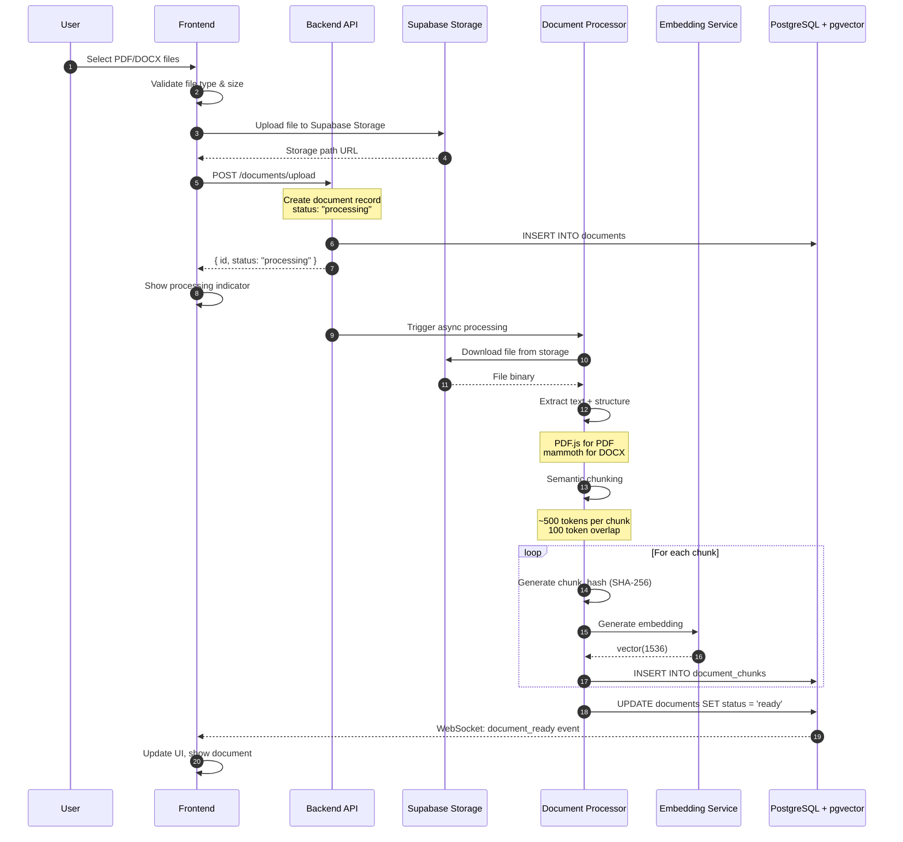
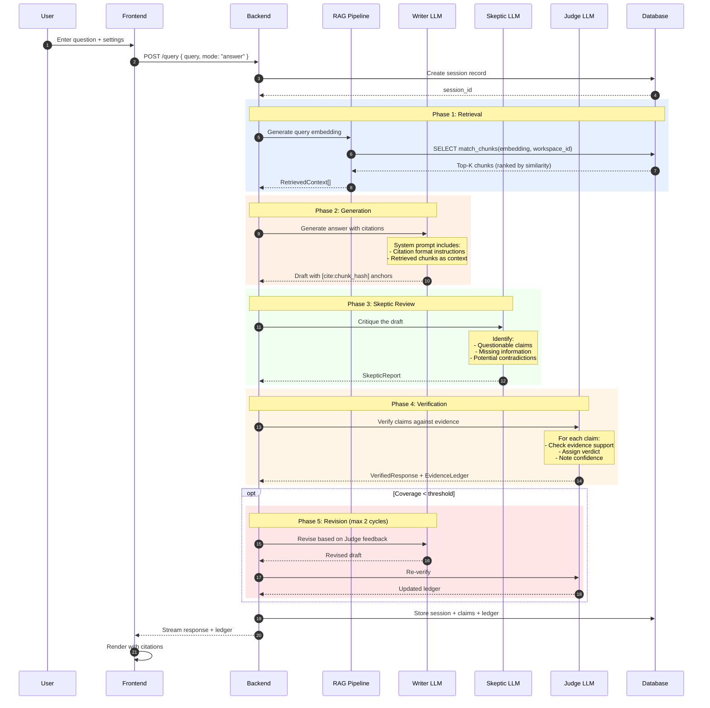
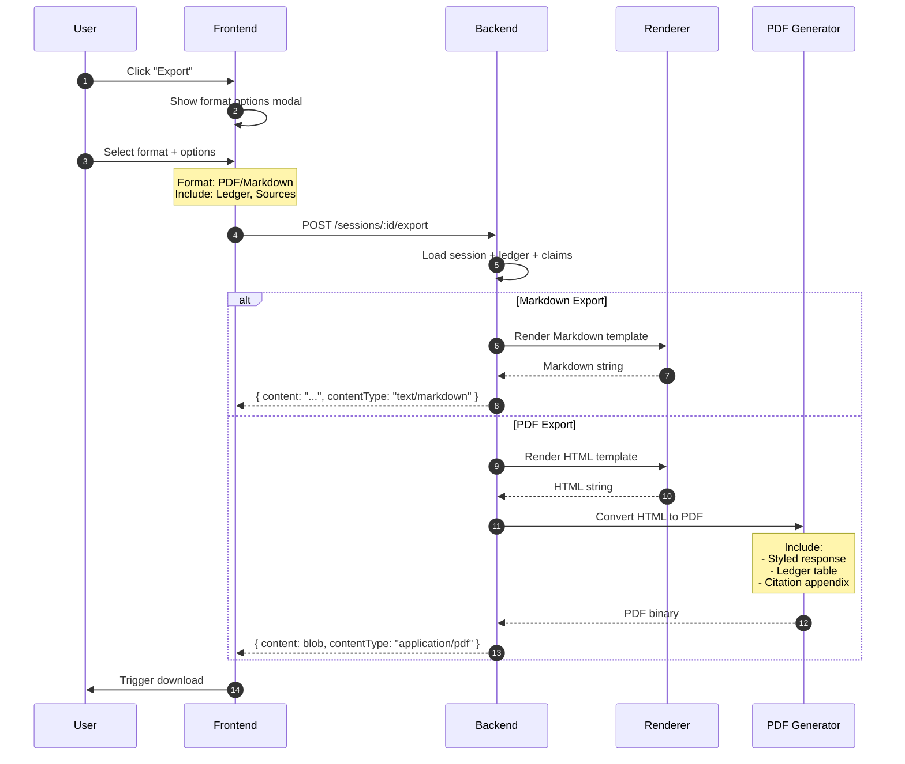
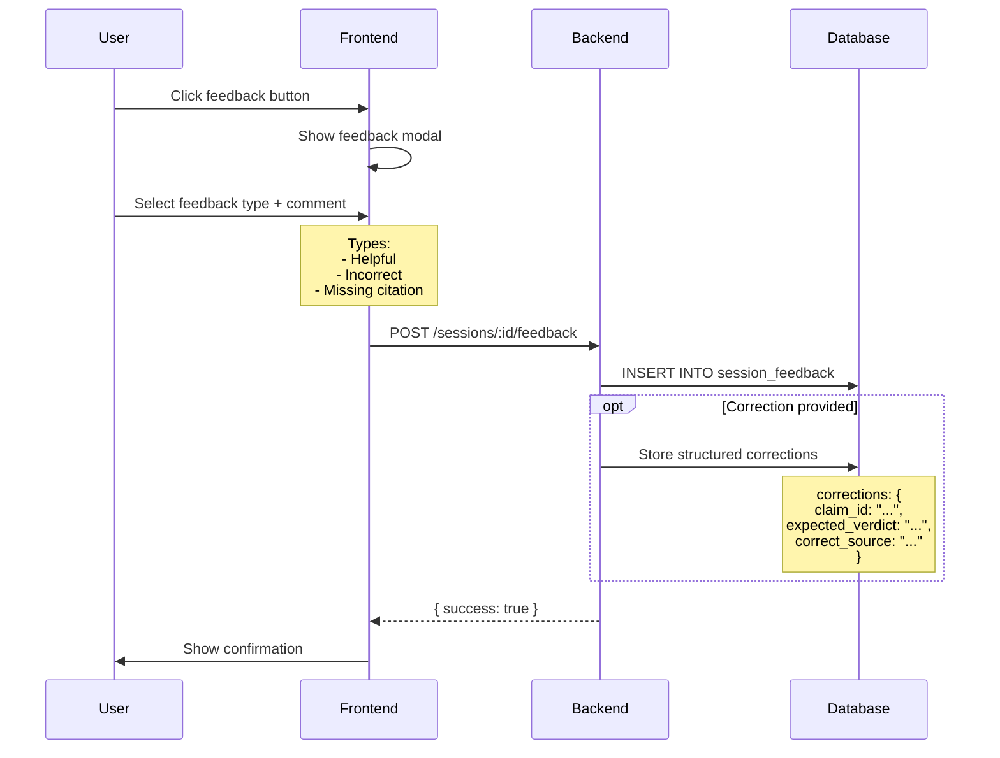

# Data Flow Architecture

> **Version:** 1.0
> **Last Updated:** 2026-01-03

---

## 1. Overview

This document describes the data pipelines that power VerityDraft, from document ingestion through query processing to evidence ledger generation.

---

## 2. Document Ingestion Pipeline

### 2.1 Sequence Diagram



### 2.2 Data Transformations

```
┌─────────────────────────────────────────────────────────────┐
│                Document Ingestion Flow                      │
├─────────────────────────────────────────────────────────────┤
│                                                             │
│  Input: Raw PDF/DOCX file                                  │
│      │                                                      │
│      ▼                                                      │
│  ┌─────────────────────────────────────────────────────┐   │
│  │  1. Text Extraction                                  │   │
│  │     - PDF: PDF.js with page boundaries              │   │
│  │     - DOCX: mammoth.js with heading detection       │   │
│  │     Output: { text, pages[], headings[] }           │   │
│  └─────────────────────────────────────────────────────┘   │
│      │                                                      │
│      ▼                                                      │
│  ┌─────────────────────────────────────────────────────┐   │
│  │  2. Structure Analysis                               │   │
│  │     - Detect headings and sections                  │   │
│  │     - Build heading_path hierarchy                  │   │
│  │     - Identify page numbers                         │   │
│  │     Output: { sections[], heading_paths[] }         │   │
│  └─────────────────────────────────────────────────────┘   │
│      │                                                      │
│      ▼                                                      │
│  ┌─────────────────────────────────────────────────────┐   │
│  │  3. Semantic Chunking                                │   │
│  │     - Target: ~500 tokens per chunk                 │   │
│  │     - Overlap: 100 tokens                           │   │
│  │     - Preserve sentence boundaries                  │   │
│  │     - Maintain heading context                      │   │
│  │     Output: Chunk[]                                 │   │
│  └─────────────────────────────────────────────────────┘   │
│      │                                                      │
│      ▼                                                      │
│  ┌─────────────────────────────────────────────────────┐   │
│  │  4. Chunk Processing                                 │   │
│  │     For each chunk:                                 │   │
│  │     - Generate chunk_hash: SHA256(content)          │   │
│  │     - Create embedding: OpenAI text-embedding-3-small│  │
│  │     - Store with metadata                           │   │
│  │     Output: document_chunks rows                    │   │
│  └─────────────────────────────────────────────────────┘   │
│                                                             │
└─────────────────────────────────────────────────────────────┘
```

### 2.3 Chunk Data Structure

```typescript
interface DocumentChunk {
  id: string;                    // UUID
  document_id: string;           // FK to documents
  chunk_hash: string;            // SHA256 of content (stable ID for citations)
  content: string;               // Chunk text
  chunk_index: number;           // Position in document
  page_number: number | null;    // Page (for PDF)
  heading_path: string[];        // ['Chapter 1', 'Section 1.2']
  start_offset: number;          // Character position in original
  end_offset: number;
  embedding: number[];           // vector(1536)
  metadata: Record<string, any>; // Additional extracted info
  created_at: string;
}
```

---

## 3. Query Processing Pipeline

### 3.1 Sequence Diagram (Answer Mode)



### 3.2 RAG (Retrieval-Augmented Generation) Flow

```
┌─────────────────────────────────────────────────────────────┐
│                    RAG Pipeline                             │
├─────────────────────────────────────────────────────────────┤
│                                                             │
│  Input: User query                                         │
│      │                                                      │
│      ▼                                                      │
│  ┌─────────────────────────────────────────────────────┐   │
│  │  1. Query Preprocessing                              │   │
│  │     - Normalize whitespace                          │   │
│  │     - (Optional) Query expansion                    │   │
│  │     Output: Processed query string                  │   │
│  └─────────────────────────────────────────────────────┘   │
│      │                                                      │
│      ▼                                                      │
│  ┌─────────────────────────────────────────────────────┐   │
│  │  2. Query Embedding                                  │   │
│  │     - OpenAI text-embedding-3-small                 │   │
│  │     - 1536 dimensions                               │   │
│  │     Output: vector(1536)                            │   │
│  └─────────────────────────────────────────────────────┘   │
│      │                                                      │
│      ▼                                                      │
│  ┌─────────────────────────────────────────────────────┐   │
│  │  3. Vector Similarity Search                         │   │
│  │     - pgvector cosine similarity                    │   │
│  │     - Filter by workspace_id                        │   │
│  │     - Threshold: similarity > 0.7                   │   │
│  │     - Limit: K = 10 (configurable)                  │   │
│  │     Output: Chunk[] with similarity scores          │   │
│  └─────────────────────────────────────────────────────┘   │
│      │                                                      │
│      ▼                                                      │
│  ┌─────────────────────────────────────────────────────┐   │
│  │  4. Context Assembly                                 │   │
│  │     - Sort by relevance                             │   │
│  │     - Deduplicate overlapping chunks                │   │
│  │     - Build context window (max tokens)             │   │
│  │     Output: Formatted context for LLM               │   │
│  └─────────────────────────────────────────────────────┘   │
│                                                             │
└─────────────────────────────────────────────────────────────┘
```

### 3.3 Vector Search SQL

```sql
-- Function for vector similarity search
CREATE OR REPLACE FUNCTION match_chunks(
  query_embedding vector(1536),
  workspace_id_param UUID,
  match_threshold FLOAT DEFAULT 0.7,
  match_count INT DEFAULT 10
)
RETURNS TABLE (
  chunk_id UUID,
  document_id UUID,
  chunk_hash TEXT,
  content TEXT,
  heading_path TEXT[],
  page_number INT,
  similarity FLOAT
)
LANGUAGE sql STABLE
AS $$
  SELECT
    dc.id as chunk_id,
    dc.document_id,
    dc.chunk_hash,
    dc.content,
    dc.heading_path,
    dc.page_number,
    1 - (dc.embedding <=> query_embedding) as similarity
  FROM document_chunks dc
  JOIN documents d ON dc.document_id = d.id
  WHERE d.workspace_id = workspace_id_param
    AND d.status = 'ready'
    AND 1 - (dc.embedding <=> query_embedding) > match_threshold
  ORDER BY dc.embedding <=> query_embedding
  LIMIT match_count;
$$;
```

---

## 4. Evidence Ledger Generation

### 4.1 Claim Extraction Flow

```mermaid
flowchart TD
    A[Writer Output] --> B[Judge: Extract Claims]
    B --> C{For Each Claim}

    C --> D[Identify Claim Text]
    D --> E[Classify Claim Type]
    E --> F[Assess Importance]
    F --> G[Find Citation Anchor]

    G --> H{Has [cite:X] anchor?}
    H -->|Yes| I[Link to chunk_hash]
    H -->|No| J[Mark as uncited]

    I --> K[Match Against Evidence]
    J --> K

    K --> L{Evidence Found?}
    L -->|Strong match| M[Verdict: Supported]
    L -->|Partial match| N[Verdict: Weak]
    L -->|Conflict found| O[Verdict: Contradicted]
    L -->|No match| P[Verdict: Not Found]

    M --> Q[Calculate Confidence]
    N --> Q
    O --> Q
    P --> Q

    Q --> R[Add to Ledger]
    R --> C

    C -->|All claims processed| S[Generate Risk Flags]
    S --> T[Compile Final Ledger]
```

### 4.2 Ledger Data Structure

```typescript
interface Claim {
  id: string;
  session_id: string;
  claim_text: string;
  claim_type: "fact" | "policy" | "numeric" | "definition";
  importance: "critical" | "material" | "minor";
  requires_citation: boolean;
  start_offset: number;  // Position in response
  end_offset: number;
}

interface LedgerEntry {
  id: string;
  session_id: string;
  claim_id: string;
  verdict: "supported" | "weak" | "contradicted" | "not_found";
  confidence_score: number;  // 0.0 - 1.0
  chunk_ids: string[];       // Evidence chunks
  evidence_snippet: string;  // Key quote
  notes: string;             // Judge's reasoning
}

interface EvidenceLedger {
  session_id: string;
  entries: LedgerEntry[];
  summary: {
    total_claims: number;
    supported: number;
    weak: number;
    contradicted: number;
    not_found: number;
    evidence_coverage: number;  // supported / (supported + not_found)
  };
  risk_flags: RiskFlag[];
  follow_up_questions: string[];
}
```

### 4.3 Verdict Assignment Logic

```
┌─────────────────────────────────────────────────────────────┐
│               Verdict Assignment Rules                      │
├─────────────────────────────────────────────────────────────┤
│                                                             │
│  SUPPORTED (Green)                                         │
│  ────────────────                                          │
│  - Claim directly stated in evidence chunk                 │
│  - Or: Claim is clear inference from evidence              │
│  - Confidence: > 0.8                                       │
│                                                             │
│  WEAK (Amber)                                              │
│  ───────────                                               │
│  - Partial evidence supports claim                         │
│  - Or: Evidence is tangentially related                    │
│  - Or: Evidence requires interpretation                    │
│  - Confidence: 0.5 - 0.8                                   │
│                                                             │
│  CONTRADICTED (Red)                                        │
│  ─────────────────                                         │
│  - Evidence directly contradicts claim                     │
│  - Or: Multiple sources conflict on this claim             │
│  - Confidence: N/A (flag for review)                       │
│                                                             │
│  NOT FOUND (Gray)                                          │
│  ────────────────                                          │
│  - No evidence found in provided documents                 │
│  - Claim cannot be verified from available sources         │
│  - Confidence: 0 (no evidence basis)                       │
│                                                             │
└─────────────────────────────────────────────────────────────┘
```

---

## 5. Export Pipeline

### 5.1 Export Flow



### 5.2 Export Content Structure

```markdown
# [Query Title]

**Generated:** 2026-01-03 14:30 UTC
**Mode:** Answer / Draft
**Workspace:** [Workspace Name]

---

## Response

[Main response content with inline citations]

According to the policy [1], employees are entitled to...

The regulation states [2] that all submissions must be...

---

## Evidence Ledger

| # | Claim | Type | Verdict | Evidence | Source |
|---|-------|------|---------|----------|--------|
| 1 | Employees are entitled to... | Policy | Supported | "All employees shall receive..." | HR Policy v3, p.12 |
| 2 | Submissions must be filed within 30 days | Fact | Supported | "Filing deadline: 30 calendar days" | Regulation 2024-01, §4.2 |
| 3 | Late fees are waived for first-time offenders | Policy | Not Found | - | - |

---

## Assumptions & Unknowns

- Claim #3 could not be verified from provided documents
- Consider uploading additional policy documents for verification

---

## Sources

1. HR Policy v3.pdf - Section 2.1, Page 12
2. Regulation 2024-01.pdf - Section 4.2, Page 8

---

*Generated by VerityDraft*
```

---

## 6. Real-time Streaming

### 6.1 WebSocket Protocol

```typescript
// Client → Server
interface QueryMessage {
  type: "query";
  payload: {
    query: string;
    mode: "answer" | "draft";
    settings: QuerySettings;
    document_ids?: string[];
  };
}

// Server → Client
interface StreamMessage {
  type:
    | "session_created"
    | "retrieval_started"
    | "retrieval_complete"
    | "generation_started"
    | "content_chunk"
    | "claim_verified"
    | "ledger_updated"
    | "generation_complete"
    | "error";
  payload: unknown;
}

// Content streaming
interface ContentChunkMessage {
  type: "content_chunk";
  payload: {
    session_id: string;
    delta: string;          // Incremental text
    citations: Citation[];  // New citations in this chunk
  };
}

// Ledger updates
interface LedgerUpdateMessage {
  type: "ledger_updated";
  payload: {
    session_id: string;
    entry: LedgerEntry;     // New or updated entry
    summary: LedgerSummary; // Current totals
  };
}
```

### 6.2 Streaming Architecture

```
┌─────────────────────────────────────────────────────────────┐
│                  Streaming Response Flow                    │
├─────────────────────────────────────────────────────────────┤
│                                                             │
│  LLM API (OpenRouter)                                      │
│      │                                                      │
│      │ Server-Sent Events / Stream                         │
│      ▼                                                      │
│  ┌─────────────────────────────────────────────────────┐   │
│  │            Response Buffer                           │   │
│  │  - Accumulate tokens                                │   │
│  │  - Detect citation anchors                          │   │
│  │  - Parse structured outputs                         │   │
│  └─────────────────────────────────────────────────────┘   │
│      │                                                      │
│      │ Processed chunks                                    │
│      ▼                                                      │
│  ┌─────────────────────────────────────────────────────┐   │
│  │            WebSocket Broadcaster                     │   │
│  │  - Send content_chunk messages                      │   │
│  │  - Send claim_verified as processed                 │   │
│  │  - Send ledger_updated progressively                │   │
│  └─────────────────────────────────────────────────────┘   │
│      │                                                      │
│      │ WebSocket messages                                  │
│      ▼                                                      │
│  ┌─────────────────────────────────────────────────────┐   │
│  │            Frontend Client                           │   │
│  │  - Append text incrementally                        │   │
│  │  - Render citations as they appear                  │   │
│  │  - Update ledger panel progressively                │   │
│  └─────────────────────────────────────────────────────┘   │
│                                                             │
└─────────────────────────────────────────────────────────────┘
```

---

## 7. Feedback Loop

### 7.1 Feedback Collection Flow



### 7.2 Feedback Data Model

```typescript
interface SessionFeedback {
  id: string;
  session_id: string;
  user_id: string;
  feedback_type: "helpful" | "incorrect" | "missing_citation";
  comment: string | null;
  corrections: ClaimCorrection[] | null;
  created_at: string;
}

interface ClaimCorrection {
  claim_id: string;
  issue: "wrong_verdict" | "wrong_evidence" | "missing_claim";
  expected_verdict?: string;
  correct_chunk_ids?: string[];
  explanation: string;
}
```

---

## 8. Data Lifecycle

### 8.1 Retention Policies

| Data Type | Default Retention | Configurable |
|-----------|-------------------|--------------|
| Documents | Until deleted | Yes |
| Chunks | Until document deleted | No |
| Sessions | 90 days | Yes |
| Feedback | 1 year | Yes |
| Audit logs | 1 year | Yes |

### 8.2 Deletion Cascade

```sql
-- When document is deleted:
DELETE FROM document_chunks WHERE document_id = :id;
-- Invalidates citations in existing sessions (handled gracefully)

-- When workspace is deleted:
DELETE FROM documents WHERE workspace_id = :id;  -- Cascades to chunks
DELETE FROM sessions WHERE workspace_id = :id;   -- Cascades to claims, ledger
DELETE FROM workspace_members WHERE workspace_id = :id;
DELETE FROM workspaces WHERE id = :id;
```

---

## 9. Error States

### 9.1 Pipeline Error Handling

| Stage | Error | Handling |
|-------|-------|----------|
| Upload | File too large | Reject with size limit message |
| Extraction | PDF corrupt | Mark document as error, notify user |
| Embedding | API timeout | Retry 3x, then mark error |
| Retrieval | No matches | Proceed with empty context, warn user |
| Writer | Model error | Fallback to alternate model |
| Skeptic | Model error | Skip skeptic, proceed to judge with warning |
| Judge | Model error | Return writer output with partial ledger |
| Export | PDF generation fails | Fallback to markdown download |

### 9.2 Graceful Degradation

```typescript
interface ProcessingResult {
  success: boolean;
  response: string;
  ledger: EvidenceLedger;
  warnings: Warning[];  // Degradation notices
  errors: Error[];      // Fatal issues
}

// Example degraded response
{
  success: true,
  response: "Based on the documents...",
  ledger: { entries: [...], summary: {...} },
  warnings: [
    {
      code: "SKEPTIC_SKIPPED",
      message: "Skeptic verification was skipped due to API error. Response may have reduced verification."
    }
  ],
  errors: []
}
```
