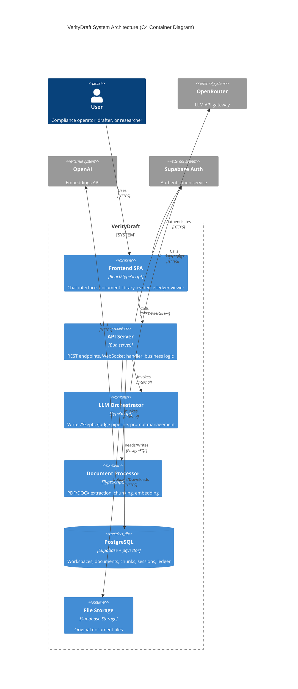
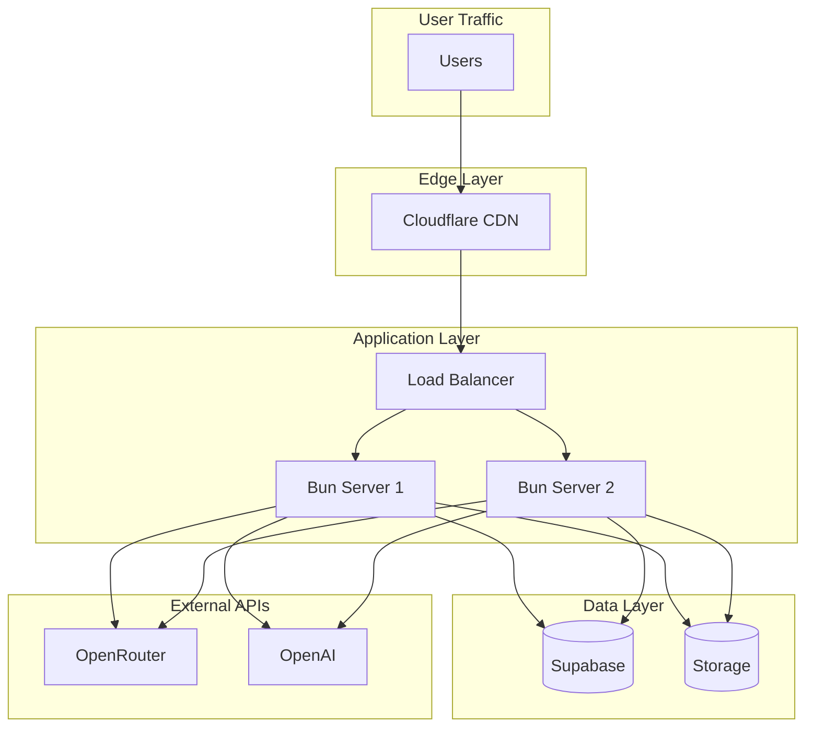

# System Architecture

> **Version:** 1.0
> **Last Updated:** 2026-01-03

---

## 1. High-Level Overview

VerityDraft is a document-grounded AI assistant built on a modern, full-stack architecture using Bun as the unified runtime.



---

## 2. Component Details

### 2.1 Frontend Layer

**Technology:** React 18+ with TypeScript, bundled by Bun

```
┌─────────────────────────────────────────────────────────────┐
│                    Frontend SPA                             │
├─────────────────────────────────────────────────────────────┤
│  ┌─────────────┐  ┌─────────────┐  ┌─────────────┐         │
│  │   Auth      │  │  Workspace  │  │   Theme     │         │
│  │  Context    │  │   Context   │  │  Context    │         │
│  └─────────────┘  └─────────────┘  └─────────────┘         │
│                                                             │
│  ┌─────────────────────────────────────────────────────┐   │
│  │                    Layout                            │   │
│  │  ┌──────────┐  ┌────────────────────────────────┐   │   │
│  │  │ Sidebar  │  │         Main Content           │   │   │
│  │  │          │  │  ┌──────────────────────────┐  │   │   │
│  │  │ - Docs   │  │  │ Chat / Document Library  │  │   │   │
│  │  │ - Chat   │  │  │ / Session View / Admin   │  │   │   │
│  │  │ - Admin  │  │  └──────────────────────────┘  │   │   │
│  │  └──────────┘  └────────────────────────────────┘   │   │
│  └─────────────────────────────────────────────────────┘   │
│                                                             │
│  ┌─────────────────────────────────────────────────────┐   │
│  │              React Query (Server State)              │   │
│  └─────────────────────────────────────────────────────┘   │
└─────────────────────────────────────────────────────────────┘
```

**Key Features:**
- Single-page application with client-side routing
- Real-time updates via WebSocket for streaming responses
- Optimistic UI updates with React Query
- Tailwind CSS for styling

### 2.2 Backend Layer

**Technology:** Bun.serve() with TypeScript

```typescript
// Server entry point structure
Bun.serve({
  port: 3000,

  routes: {
    // Static HTML entry point
    "/": indexHtml,

    // API routes
    "/api/v1/auth/*": authRouter,
    "/api/v1/workspaces/*": workspaceRouter,
    "/api/v1/documents/*": documentRouter,
    "/api/v1/query": queryHandler,
    "/api/v1/sessions/*": sessionRouter,
    "/api/v1/admin/*": adminRouter,
  },

  // WebSocket for streaming
  websocket: {
    open: handleWsOpen,
    message: handleWsMessage,
    close: handleWsClose,
  },
});
```

**Responsibilities:**
- REST API endpoint handling
- WebSocket connection management
- Request validation and authentication
- Business logic orchestration
- Database operations

### 2.3 LLM Orchestration Layer

**Technology:** TypeScript service with OpenRouter client

```
┌─────────────────────────────────────────────────────────────┐
│                  LLM Orchestration Layer                    │
├─────────────────────────────────────────────────────────────┤
│                                                             │
│  ┌─────────────────────────────────────────────────────┐   │
│  │              OpenRouter Client                       │   │
│  │  - Multi-model routing                              │   │
│  │  - Streaming response handling                      │   │
│  │  - Token counting                                   │   │
│  └─────────────────────────────────────────────────────┘   │
│                            │                                │
│            ┌───────────────┼───────────────┐               │
│            ▼               ▼               ▼               │
│       ┌─────────┐    ┌─────────┐    ┌─────────┐           │
│       │  Writer │    │ Skeptic │    │  Judge  │           │
│       │ Service │    │ Service │    │ Service │           │
│       └─────────┘    └─────────┘    └─────────┘           │
│                                                             │
│  ┌─────────────────────────────────────────────────────┐   │
│  │              Prompt Manager                          │   │
│  │  - Template storage                                 │   │
│  │  - Variable substitution                            │   │
│  │  - Context window management                        │   │
│  └─────────────────────────────────────────────────────┘   │
│                                                             │
└─────────────────────────────────────────────────────────────┘
```

**Responsibilities:**
- Model selection and routing
- Prompt template management
- Response streaming and aggregation
- Token usage tracking
- Retry and fallback logic

### 2.4 Document Processing Layer

**Technology:** TypeScript with PDF/DOCX parsing libraries

```
┌─────────────────────────────────────────────────────────────┐
│               Document Processing Pipeline                  │
├─────────────────────────────────────────────────────────────┤
│                                                             │
│  ┌──────────┐  ┌──────────┐  ┌──────────┐  ┌──────────┐   │
│  │  Upload  │─▶│  Extract │─▶│  Chunk   │─▶│  Embed   │   │
│  │  Handler │  │  Text    │  │  Content │  │  Chunks  │   │
│  └──────────┘  └──────────┘  └──────────┘  └──────────┘   │
│       │              │              │              │        │
│       ▼              ▼              ▼              ▼        │
│  ┌──────────┐  ┌──────────┐  ┌──────────┐  ┌──────────┐   │
│  │ Supabase │  │ PDF.js / │  │ Semantic │  │  OpenAI  │   │
│  │ Storage  │  │ mammoth  │  │ Chunker  │  │ Embed API│   │
│  └──────────┘  └──────────┘  └──────────┘  └──────────┘   │
│                                                             │
└─────────────────────────────────────────────────────────────┘
```

**Responsibilities:**
- File upload handling and validation
- Text extraction from PDF/DOCX
- Semantic chunking with overlap
- Stable chunk ID generation (content hash)
- Embedding creation via OpenAI API
- Metadata extraction (titles, dates, versions)

### 2.5 Data Layer

**Technology:** Supabase (PostgreSQL + pgvector)

```
┌─────────────────────────────────────────────────────────────┐
│                     Data Layer                              │
├─────────────────────────────────────────────────────────────┤
│                                                             │
│  ┌─────────────────────────────────────────────────────┐   │
│  │              PostgreSQL (Supabase)                   │   │
│  │                                                      │   │
│  │  ┌────────────────┐  ┌────────────────┐             │   │
│  │  │   Workspaces   │  │   Documents    │             │   │
│  │  │   + Members    │──│   + Chunks     │             │   │
│  │  └────────────────┘  └────────────────┘             │   │
│  │           │                   │                      │   │
│  │           ▼                   ▼                      │   │
│  │  ┌────────────────┐  ┌────────────────┐             │   │
│  │  │    Sessions    │──│  Evidence      │             │   │
│  │  │    + Claims    │  │  Ledger        │             │   │
│  │  └────────────────┘  └────────────────┘             │   │
│  │                                                      │   │
│  │  ┌────────────────────────────────────────────┐     │   │
│  │  │         pgvector Extension                  │     │   │
│  │  │  - vector(1536) columns                     │     │   │
│  │  │  - HNSW index for similarity search         │     │   │
│  │  │  - cosine distance operations               │     │   │
│  │  └────────────────────────────────────────────┘     │   │
│  └─────────────────────────────────────────────────────┘   │
│                                                             │
│  ┌─────────────────────────────────────────────────────┐   │
│  │              Supabase Storage                        │   │
│  │  - Original document files                          │   │
│  │  - Workspace-isolated buckets                       │   │
│  │  - Signed URL access                                │   │
│  └─────────────────────────────────────────────────────┘   │
│                                                             │
└─────────────────────────────────────────────────────────────┘
```

**Responsibilities:**
- Persistent storage for all entities
- Vector similarity search for RAG
- Row-level security for tenant isolation
- File storage for original documents

### 2.6 Authentication Layer

**Technology:** Supabase Auth

```
┌─────────────────────────────────────────────────────────────┐
│                  Authentication Flow                        │
├─────────────────────────────────────────────────────────────┤
│                                                             │
│  User ──────┬───▶ Supabase Auth ───▶ JWT Token             │
│             │         │                  │                  │
│             │         ▼                  ▼                  │
│             │    ┌─────────┐      ┌─────────────┐          │
│             │    │ Email/  │      │ Token Claims│          │
│             │    │ OAuth   │      │ - user_id   │          │
│             │    │ Magic   │      │ - email     │          │
│             │    │ Link    │      │ - metadata  │          │
│             │    └─────────┘      └─────────────┘          │
│             │                            │                  │
│             └────────────────────────────┼──────────────┐  │
│                                          ▼              │  │
│                                   ┌─────────────┐       │  │
│                                   │  Workspace  │◀──────┘  │
│                                   │  Membership │          │
│                                   │  Check      │          │
│                                   └─────────────┘          │
│                                                             │
└─────────────────────────────────────────────────────────────┘
```

**Supported Methods:**
- Email/password authentication
- OAuth providers (Google, GitHub)
- Magic link (passwordless)

---

## 3. Key Design Decisions

### 3.1 Why 3-LLM Pipeline?

| Approach | Pros | Cons |
|----------|------|------|
| Single LLM | Simple, fast | No adversarial checking |
| 2-LLM (Writer + Judge) | Moderate verification | Missing challenge phase |
| **3-LLM (Writer + Skeptic + Judge)** | Full adversarial loop | Higher cost, complexity |

**Decision:** 3-LLM for maximum hallucination reduction. Skeptic catches issues Writer misses, Judge provides final verification.

### 3.2 Why Supabase + pgvector?

| Alternative | Pros | Cons |
|-------------|------|------|
| Pinecone | Dedicated vector DB, scale | Extra service, cost |
| Weaviate | Hybrid search, filters | Operational complexity |
| **Supabase + pgvector** | Unified stack, SQL familiarity | Slightly lower scale |

**Decision:** Supabase provides auth, storage, and database in one. pgvector sufficient for MVP scale.

### 3.3 Why Bun?

| Alternative | Pros | Cons |
|-------------|------|------|
| Node.js + Express | Mature ecosystem | Multiple tools needed |
| Deno | Security, modern | Ecosystem compatibility |
| **Bun** | All-in-one, fast | Newer ecosystem |

**Decision:** Bun provides runtime, bundler, test runner, and package manager in one. Performance advantages for streaming.

### 3.4 Why OpenRouter?

| Alternative | Pros | Cons |
|-------------|------|------|
| Direct OpenAI | Official SDK | Single provider |
| Direct Anthropic | Claude access | Single provider |
| **OpenRouter** | Multi-model, unified API | Additional layer |

**Decision:** OpenRouter allows using best model for each role (e.g., Claude for writing, cheaper models for skeptic).

---

## 4. Security Architecture

### 4.1 Network Security

```
┌─────────────────────────────────────────────────────────────┐
│                   Network Boundaries                        │
├─────────────────────────────────────────────────────────────┤
│                                                             │
│  Internet                                                   │
│      │                                                      │
│      ▼                                                      │
│  ┌─────────────────────────────────────────────────────┐   │
│  │              CDN / Edge (Cloudflare)                 │   │
│  │  - DDoS protection                                  │   │
│  │  - TLS termination                                  │   │
│  │  - Rate limiting                                    │   │
│  └─────────────────────────────────────────────────────┘   │
│      │                                                      │
│      ▼                                                      │
│  ┌─────────────────────────────────────────────────────┐   │
│  │              Application Layer                       │   │
│  │  - JWT validation                                   │   │
│  │  - Request validation                               │   │
│  │  - CORS enforcement                                 │   │
│  └─────────────────────────────────────────────────────┘   │
│      │                                                      │
│      ▼                                                      │
│  ┌─────────────────────────────────────────────────────┐   │
│  │              Data Layer                              │   │
│  │  - Row-level security                               │   │
│  │  - Encrypted at rest                                │   │
│  │  - Private network access                           │   │
│  └─────────────────────────────────────────────────────┘   │
│                                                             │
└─────────────────────────────────────────────────────────────┘
```

### 4.2 Data Isolation

```sql
-- Row-Level Security Policy Example
CREATE POLICY workspace_isolation ON documents
  USING (
    workspace_id IN (
      SELECT workspace_id
      FROM workspace_members
      WHERE user_id = auth.uid()
    )
  );
```

---

## 5. Deployment Architecture

### 5.1 Production Topology



### 5.2 Environment Configuration

| Environment | Purpose | Configuration |
|-------------|---------|---------------|
| Development | Local development | Local Bun, Supabase local |
| Staging | Pre-production testing | Supabase staging project |
| Production | Live traffic | Supabase production, CDN |

---

## 6. Scalability Considerations

### 6.1 Horizontal Scaling

| Component | Scaling Strategy |
|-----------|------------------|
| API Server | Multiple Bun workers behind load balancer |
| Database | Supabase connection pooling (PgBouncer) |
| Storage | Supabase Storage (S3-compatible) |
| LLM Calls | Async processing with queuing |

### 6.2 Performance Targets

| Metric | Target | Strategy |
|--------|--------|----------|
| API Latency (P95) | < 100ms | Connection pooling, caching |
| Q&A Response (P95) | < 20s | Streaming, parallel retrieval |
| Draft Response (P95) | < 35s | Bounded revision loops |
| Concurrent Users | 100+ | Horizontal scaling |

### 6.3 Caching Strategy

```
┌─────────────────────────────────────────────────────────────┐
│                    Caching Layers                           │
├─────────────────────────────────────────────────────────────┤
│                                                             │
│  Layer 1: Query Embedding Cache                            │
│  - Cache query → embedding for repeated queries            │
│  - TTL: 1 hour                                             │
│                                                             │
│  Layer 2: Retrieval Cache                                  │
│  - Cache query → chunks for identical queries              │
│  - TTL: 5 minutes (document updates invalidate)            │
│                                                             │
│  Layer 3: Response Cache                                   │
│  - Cache identical (query + context) → response            │
│  - TTL: 1 hour (manual invalidation)                       │
│                                                             │
└─────────────────────────────────────────────────────────────┘
```

---

## 7. Monitoring & Observability

### 7.1 Key Metrics

| Category | Metrics |
|----------|---------|
| Availability | Uptime, error rate, health checks |
| Performance | Response time (P50, P95, P99), throughput |
| Business | Evidence coverage, export rate, sessions |
| Cost | Token usage, API costs per session |

### 7.2 Logging Strategy

```typescript
interface LogEntry {
  timestamp: string;
  level: "debug" | "info" | "warn" | "error";
  service: string;
  trace_id: string;
  user_id?: string;
  workspace_id?: string;
  message: string;
  metadata?: Record<string, unknown>;
}
```

### 7.3 Alerting

| Condition | Severity | Action |
|-----------|----------|--------|
| Error rate > 5% | Critical | Page on-call |
| P95 latency > 30s | Warning | Slack notification |
| LLM API errors | Warning | Fallback to alternate model |
| Database connection failures | Critical | Page on-call |

---

## 8. Disaster Recovery

### 8.1 Backup Strategy

| Data | Backup Frequency | Retention |
|------|------------------|-----------|
| Database | Daily automated | 30 days |
| Document files | Continuous (S3) | Until deletion |
| Configuration | Git version control | Indefinite |

### 8.2 Recovery Procedures

| Scenario | RTO | RPO | Procedure |
|----------|-----|-----|-----------|
| Server failure | 5 min | 0 | Auto-failover to healthy instance |
| Database corruption | 1 hour | 24 hours | Restore from daily backup |
| Region failure | 4 hours | 1 hour | Failover to secondary region |

---

## 9. Future Architecture Considerations

### 9.1 Potential Enhancements

| Enhancement | Trigger | Implementation |
|-------------|---------|----------------|
| Background job queue | Long document processing | Redis + BullMQ |
| Real-time collaboration | Multi-user editing | Supabase Realtime |
| Audit log service | Compliance requirements | Separate audit database |
| ML pipeline | Custom embeddings | Dedicated ML infrastructure |

### 9.2 Migration Path

```
MVP                    v1                      v2
────                   ──                      ──
Single region     →    Multi-region       →    Global CDN
Sync processing   →    Background jobs    →    Event-driven
Basic auth        →    SSO/SAML          →    Fine-grained RBAC
```
