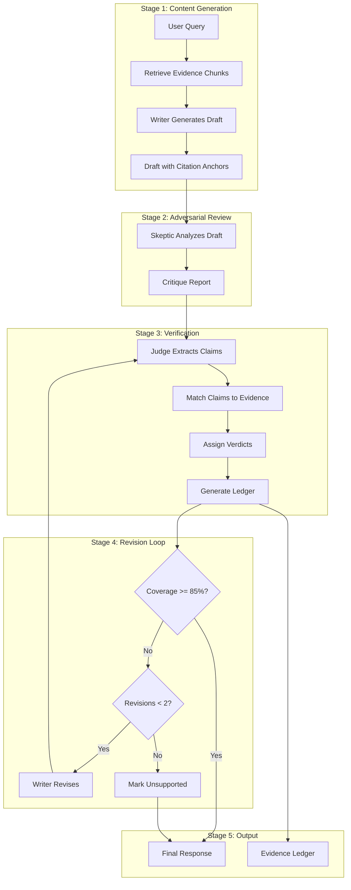
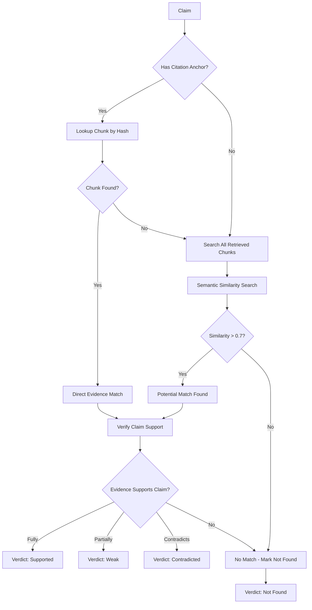
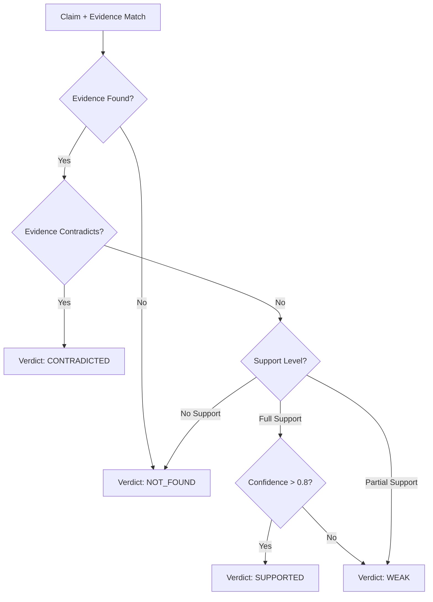

# Verification Workflow

> **Version:** 1.0
> **Last Updated:** 2026-01-03

---

## 1. Overview

The verification workflow is the core business logic that ensures all generated content is grounded in source documents. This document details the claim extraction, evidence matching, and verdict assignment processes.

---

## 2. Workflow Stages



---

## 3. Claim Extraction Process

### 3.1 What is a Claim?

A **claim** is any statement in the generated response that:
- Asserts a fact about reality
- States a rule, policy, or requirement
- Provides a numeric value or date
- Defines or explains a concept

### 3.2 Claim Identification Rules

```typescript
interface ClaimIdentificationRules {
  // Statements that ARE claims
  include: [
    "Factual assertions about policies, procedures, or rules",
    "Numeric values (dates, amounts, percentages)",
    "Definitions of terms or concepts",
    "Causal statements (X leads to Y)",
    "Comparative statements (X is greater than Y)",
    "Temporal statements (X happens before Y)"
  ];

  // Statements that are NOT claims
  exclude: [
    "Questions",
    "Hypotheticals clearly marked as such",
    "Personal opinions prefixed with 'I think' or 'In my view'",
    "Logical connectors ('therefore', 'however')",
    "Acknowledgments ('Thank you', 'I understand')",
    "Meta-statements about the response itself"
  ];
}
```

### 3.3 Claim Extraction Algorithm

```mermaid
flowchart TD
    A[Response Text] --> B[Sentence Tokenization]
    B --> C{For Each Sentence}

    C --> D[Parse Sentence Structure]
    D --> E{Contains Assertion?}

    E -->|No| C
    E -->|Yes| F[Extract Claim Text]

    F --> G[Classify Claim Type]
    G --> H[Assess Importance]
    H --> I[Find Citation Anchor]

    I --> J{Has [cite:X]?}
    J -->|Yes| K[Link to Chunk Hash]
    J -->|No| L[Mark as Uncited]

    K --> M[Add to Claims List]
    L --> M
    M --> C

    C -->|All Processed| N[Return Claims[]]
```

### 3.4 Claim Types

| Type | Description | Examples |
|------|-------------|----------|
| **fact** | Verifiable statement about reality | "The office opens at 9 AM" |
| **policy** | Rule, procedure, or requirement | "All requests must be submitted in writing" |
| **numeric** | Numbers, dates, amounts, percentages | "The fee is $150" |
| **definition** | Explanation of terms or concepts | "A 'business day' refers to Monday through Friday" |

### 3.5 Importance Levels

| Level | Definition | Citation Requirement |
|-------|------------|---------------------|
| **critical** | Core claims the response depends on | Must be cited |
| **material** | Important supporting claims | Should be cited |
| **minor** | Contextual or background claims | Citation optional |

```typescript
function assessImportance(claim: string, context: ResponseContext): Importance {
  // Critical: Answer to the main question
  if (isDirectAnswer(claim, context.query)) {
    return "critical";
  }

  // Critical: Numeric claims (easily verifiable, high stakes)
  if (containsNumeric(claim)) {
    return "critical";
  }

  // Material: Policy statements
  if (isPolicyStatement(claim)) {
    return "material";
  }

  // Material: Claims with qualifiers that suggest importance
  if (containsImportanceMarkers(claim)) {
    return "material";
  }

  // Minor: Background, context, definitions
  return "minor";
}
```

---

## 4. Evidence Matching Algorithm

### 4.1 Matching Process



### 4.2 Semantic Similarity Check

```typescript
async function findEvidenceForClaim(
  claim: string,
  retrievedChunks: Chunk[]
): Promise<EvidenceMatch[]> {
  // Generate claim embedding
  const claimEmbedding = await generateEmbedding(claim);

  const matches: EvidenceMatch[] = [];

  for (const chunk of retrievedChunks) {
    const similarity = cosineSimilarity(claimEmbedding, chunk.embedding);

    if (similarity > 0.7) {
      matches.push({
        chunk,
        similarity,
        matchType: "semantic"
      });
    }
  }

  // Sort by similarity descending
  return matches.sort((a, b) => b.similarity - a.similarity);
}
```

### 4.3 Support Verification

```typescript
interface SupportVerification {
  isSupported: boolean;
  supportLevel: "full" | "partial" | "none" | "contradicted";
  evidence: string;
  reasoning: string;
}

async function verifySupportLevel(
  claim: string,
  evidenceChunk: Chunk
): Promise<SupportVerification> {
  // Use LLM to verify if evidence supports claim
  const prompt = `
    Claim: "${claim}"

    Evidence: "${evidenceChunk.content}"

    Does the evidence support the claim?
    Answer with: FULL, PARTIAL, NONE, or CONTRADICTED
    Provide brief reasoning.
  `;

  const response = await llm.complete(prompt);

  return parseVerificationResponse(response);
}
```

---

## 5. Verdict Assignment Rules

### 5.1 Verdict Decision Tree



### 5.2 Confidence Scoring

```typescript
function calculateConfidence(
  claim: string,
  evidence: EvidenceMatch[],
  supportLevel: SupportLevel
): number {
  let confidence = 0;

  // Base confidence from support level
  switch (supportLevel) {
    case "full":
      confidence = 0.85;
      break;
    case "partial":
      confidence = 0.6;
      break;
    case "none":
      confidence = 0;
      break;
  }

  // Boost for multiple evidence sources
  if (evidence.length > 1) {
    confidence += 0.05 * Math.min(evidence.length - 1, 3);
  }

  // Boost for high semantic similarity
  const avgSimilarity = evidence.reduce((sum, e) => sum + e.similarity, 0) / evidence.length;
  if (avgSimilarity > 0.85) {
    confidence += 0.05;
  }

  // Penalty for indirect evidence (inference required)
  if (requiresInference(claim, evidence)) {
    confidence -= 0.1;
  }

  return Math.min(Math.max(confidence, 0), 1);
}
```

### 5.3 Verdict Definitions

| Verdict | Confidence Range | Criteria |
|---------|------------------|----------|
| **Supported** | > 0.8 | Claim directly stated or clearly implied in evidence |
| **Weak** | 0.5 - 0.8 | Evidence partially supports or requires interpretation |
| **Contradicted** | N/A | Evidence conflicts with claim |
| **Not Found** | 0 | No relevant evidence in provided documents |

---

## 6. Revision Loop Logic

### 6.1 When to Revise

```typescript
interface RevisionDecision {
  shouldRevise: boolean;
  reason: string;
  instructions: string[];
}

function decideRevision(
  ledger: EvidenceLedger,
  revisionCount: number
): RevisionDecision {
  // Check revision limit
  if (revisionCount >= 2) {
    return {
      shouldRevise: false,
      reason: "Maximum revision cycles reached",
      instructions: []
    };
  }

  // Check coverage threshold
  const coverage = ledger.summary.evidence_coverage;
  if (coverage >= 0.85) {
    return {
      shouldRevise: false,
      reason: "Coverage threshold met",
      instructions: []
    };
  }

  // Check for critical unsupported claims
  const criticalUnsupported = ledger.entries.filter(
    e => e.claim.importance === "critical" && e.verdict === "not_found"
  );

  if (criticalUnsupported.length > 0) {
    return {
      shouldRevise: true,
      reason: "Critical claims lack evidence",
      instructions: criticalUnsupported.map(e =>
        `Remove or qualify claim: "${e.claim.text}"`
      )
    };
  }

  // Check for contradictions
  const contradicted = ledger.entries.filter(e => e.verdict === "contradicted");
  if (contradicted.length > 0) {
    return {
      shouldRevise: true,
      reason: "Claims contradict evidence",
      instructions: contradicted.map(e =>
        `Correct claim based on evidence: "${e.claim.text}"`
      )
    };
  }

  // Coverage too low, general revision needed
  return {
    shouldRevise: true,
    reason: `Coverage ${(coverage * 100).toFixed(0)}% below 85% threshold`,
    instructions: ["Strengthen citations or remove unsupported claims"]
  };
}
```

### 6.2 Revision Strategies

| Issue | Revision Strategy |
|-------|-------------------|
| Claim unsupported | Remove claim OR add "not found in documents" qualifier |
| Claim weak | Strengthen wording to match evidence OR weaken claim |
| Claim contradicted | Correct claim to match evidence |
| Low overall coverage | Add more citations to existing claims |

### 6.3 Revision Termination

```typescript
interface RevisionTermination {
  finalResponse: string;
  finalLedger: EvidenceLedger;
  warnings: Warning[];
}

function terminateRevision(
  revisionHistory: RevisionAttempt[],
  currentLedger: EvidenceLedger
): RevisionTermination {
  const warnings: Warning[] = [];

  // Check if any improvement was made
  if (revisionHistory.length > 1) {
    const firstCoverage = revisionHistory[0].ledger.summary.evidence_coverage;
    const lastCoverage = currentLedger.summary.evidence_coverage;

    if (lastCoverage <= firstCoverage) {
      warnings.push({
        code: "NO_IMPROVEMENT",
        message: "Revisions did not improve evidence coverage"
      });
    }
  }

  // Warn about remaining unsupported claims
  const unsupported = currentLedger.entries.filter(
    e => e.verdict === "not_found" && e.claim.importance !== "minor"
  );

  if (unsupported.length > 0) {
    warnings.push({
      code: "UNSUPPORTED_CLAIMS",
      message: `${unsupported.length} material claims could not be verified`,
      details: unsupported.map(e => e.claim.text)
    });
  }

  return {
    finalResponse: revisionHistory[revisionHistory.length - 1].response,
    finalLedger: currentLedger,
    warnings
  };
}
```

---

## 7. Quality Metrics

### 7.1 Evidence Coverage

```typescript
function calculateEvidenceCoverage(ledger: EvidenceLedger): number {
  const materialClaims = ledger.entries.filter(
    e => e.claim.importance !== "minor"
  );

  if (materialClaims.length === 0) return 1.0;

  const supportedOrWeak = materialClaims.filter(
    e => e.verdict === "supported" || e.verdict === "weak"
  );

  return supportedOrWeak.length / materialClaims.length;
}
```

### 7.2 Unsupported Claim Rate

```typescript
function calculateUnsupportedRate(ledger: EvidenceLedger): number {
  const materialClaims = ledger.entries.filter(
    e => e.claim.importance !== "minor"
  );

  if (materialClaims.length === 0) return 0;

  const notFound = materialClaims.filter(e => e.verdict === "not_found");

  return notFound.length / materialClaims.length;
}
```

### 7.3 Quality Gates

| Metric | Threshold | Action if Failed |
|--------|-----------|------------------|
| Evidence coverage | >= 85% | Trigger revision |
| Unsupported rate | <= 5% | Mark unsupported clearly |
| Critical unsupported | 0 | Must revise or remove |
| Contradictions | 0 | Must correct |

---

## 8. Edge Cases

### 8.1 No Retrieved Evidence

```typescript
if (retrievedChunks.length === 0) {
  return {
    response: "I could not find relevant information in the provided documents to answer your question.",
    ledger: {
      entries: [],
      summary: { total_claims: 0, evidence_coverage: 0 }
    },
    risk_flags: [{
      type: "no_evidence",
      severity: "high",
      description: "No documents matched the query"
    }]
  };
}
```

### 8.2 Conflicting Evidence

```typescript
function handleConflictingEvidence(
  claim: string,
  evidence: EvidenceMatch[]
): ConflictResolution {
  // Check for conflicts between evidence sources
  const conflicts = findConflicts(evidence);

  if (conflicts.length > 0) {
    return {
      verdict: "contradicted",
      notes: `Conflicting evidence found: ${conflicts.map(c => c.summary).join("; ")}`,
      risk_flag: {
        type: "conflict",
        severity: "high",
        description: "Multiple sources disagree on this claim"
      }
    };
  }
}
```

### 8.3 Outdated Documents

```typescript
function checkDocumentFreshness(
  chunk: Chunk,
  currentDate: Date
): FreshnessWarning | null {
  const docDate = chunk.metadata.inferred_date;

  if (!docDate) return null;

  const ageInDays = (currentDate.getTime() - docDate.getTime()) / (1000 * 60 * 60 * 24);

  if (ageInDays > 365) {
    return {
      type: "outdated_source",
      severity: "medium",
      description: `Source document is ${Math.floor(ageInDays / 365)} years old`
    };
  }

  return null;
}
```

---

## 9. Verification Audit Trail

### 9.1 What Gets Logged

```typescript
interface VerificationAudit {
  session_id: string;
  timestamp: string;
  user_id: string;
  workspace_id: string;

  // Input
  query: string;
  mode: "answer" | "draft";
  retrieved_chunk_ids: string[];

  // Processing
  revision_history: RevisionAttempt[];
  final_coverage: number;
  final_unsupported_rate: number;

  // Output
  claim_count: number;
  verdict_distribution: Record<Verdict, number>;
  risk_flags: RiskFlag[];

  // Performance
  total_duration_ms: number;
  llm_calls: number;
  token_usage: TokenUsage;
}
```

### 9.2 Audit Retention

- All verification audits retained for 90 days (default)
- Configurable per workspace
- Supports compliance and debugging needs
