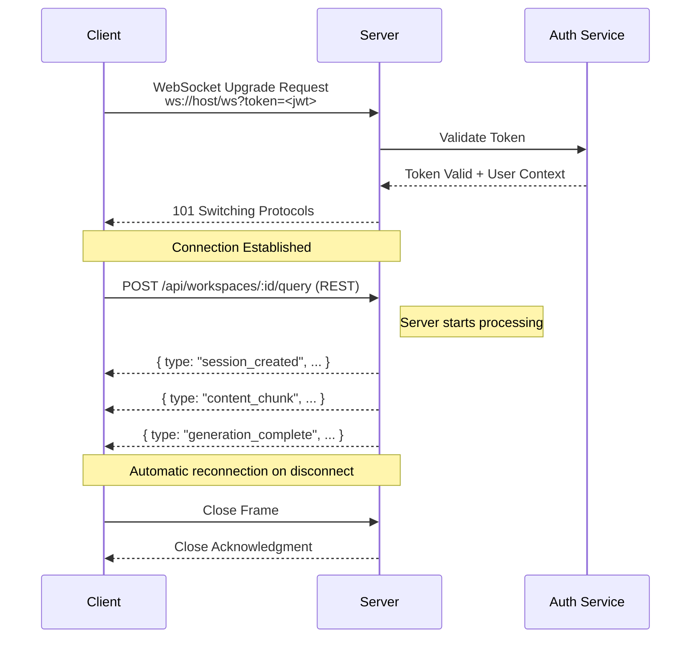

# WebSocket Protocol

> **Version:** 1.1
> **Endpoint:** `/ws`
> **Last Updated:** 2026-01-04

---

## 1. Overview

VerityDraft uses WebSocket connections for **receiving** real-time streaming of query responses and verification updates. Queries are initiated via REST API, and the WebSocket receives the streaming response events.

**Architecture Pattern:** REST-initiated queries with WebSocket streaming

---

## 2. Connection Lifecycle

### 2.1 Connection Flow



### 2.2 Connection URL

```
ws://localhost:8000/ws?token=<jwt_token>
# or in production:
wss://api.veritydraft.com/ws?token=<jwt_token>
```

### 2.3 Connection Parameters

| Parameter | Required | Description |
|-----------|----------|-------------|
| token | Yes | Supabase JWT token passed as query parameter |

---

## 3. Message Format

### 3.1 Base Message Structure

All messages follow this structure:

```typescript
interface WebSocketMessage {
  type: MessageType;
  payload?: unknown;
}
```

### 3.2 Message Types

#### Client → Server

The WebSocket is primarily **receive-only**. Queries are initiated via REST API, not WebSocket.

| Type | Description | Status |
|------|-------------|--------|
| `cancel` | Cancel ongoing query | Future |
| `subscribe` | Subscribe to session updates | Future |
| `unsubscribe` | Unsubscribe from session | Future |

**Note:** The current implementation does not use client-to-server WebSocket messages for query initiation. Use `POST /api/workspaces/:id/query` instead.

#### Server → Client

| Type | Description |
|------|-------------|
| `error` | Error notification |
| `session_created` | New session started |
| `retrieval_started` | Document search began |
| `retrieval_complete` | Documents retrieved |
| `generation_started` | LLM generation began |
| `content_chunk` | Streaming content delta |
| `claim_verified` | Claim verification result |
| `ledger_updated` | Ledger entry added/updated |
| `generation_complete` | Full response ready |
| `session_error` | Query processing failed |

---

## 4. Query Initiation (REST API)

Queries are initiated via REST API, not WebSocket. The WebSocket only receives streaming events.

### 4.1 Submit Query

```
POST /api/workspaces/:workspace_id/query
```

**Request:**
```json
{
  "query": "What is the annual leave policy?",
  "mode": "answer"
}
```

**Response:** Triggers WebSocket events starting with `session_created`.

See [API Specification](./api-specification.md) for full details.

### 4.2 Future: Cancel Message (Not Yet Implemented)

```typescript
interface CancelMessage {
  type: "cancel";
  payload: {
    request_id?: string;
    session_id?: string;
  };
}
```

### 4.3 Future: Subscribe Message (Not Yet Implemented)

```typescript
interface SubscribeMessage {
  type: "subscribe";
  payload: {
    session_id: string;
  };
}
```

---

## 5. Server Messages

### 5.1 Session Created

```typescript
interface SessionCreatedMessage {
  type: "session_created";
  payload: {
    session_id: string;
    request_id: string;
    workspace_id: string;
    created_at: string;
  };
}
```

### 5.2 Retrieval Events

```typescript
interface RetrievalStartedMessage {
  type: "retrieval_started";
  payload: {
    session_id: string;
  };
}

interface RetrievalCompleteMessage {
  type: "retrieval_complete";
  payload: {
    session_id: string;
    chunks_retrieved: number;
    documents_matched: number;
  };
}
```

### 5.3 Content Chunk

```typescript
interface ContentChunkMessage {
  type: "content_chunk";
  payload: {
    session_id: string;
    delta: string;              // Incremental text
    position: number;           // Character position
    citations?: Citation[];     // New citations in this chunk
  };
}

interface Citation {
  anchor: string;               // [cite:abc123]
  chunk_hash: string;           // abc123
  position: number;             // Position in full response
}
```

**Example:**
```json
{
  "type": "content_chunk",
  "payload": {
    "session_id": "ses_abc123",
    "delta": " the policy states [cite:a1b2c3d4]",
    "position": 45,
    "citations": [
      {
        "anchor": "[cite:a1b2c3d4]",
        "chunk_hash": "a1b2c3d4",
        "position": 62
      }
    ]
  }
}
```

### 5.4 Claim Verified

```typescript
interface ClaimVerifiedMessage {
  type: "claim_verified";
  payload: {
    session_id: string;
    claim: {
      id: string;
      text: string;
      type: "fact" | "policy" | "numeric" | "definition";
      importance: "critical" | "material" | "minor";
    };
    verdict: "supported" | "weak" | "contradicted" | "not_found";
    confidence: number;
    evidence_snippet?: string;
  };
}
```

### 5.5 Ledger Updated

```typescript
interface LedgerUpdatedMessage {
  type: "ledger_updated";
  payload: {
    session_id: string;
    entry: LedgerEntry;
    summary: {
      total_claims: number;
      supported: number;
      weak: number;
      contradicted: number;
      not_found: number;
      evidence_coverage: number;
    };
  };
}
```

### 5.6 Generation Complete

```typescript
interface GenerationCompleteMessage {
  type: "generation_complete";
  payload: {
    session_id: string;
    request_id: string;
    response: string;
    evidence_ledger: EvidenceLedger;
    risk_flags: RiskFlag[];
    follow_up_questions: string[];
    metadata: {
      evidence_coverage: number;
      unsupported_claim_count: number;
      processing_time_ms: number;
      token_count: {
        writer: number;
        skeptic: number;
        judge: number;
        total: number;
      };
      revision_cycles: number;
    };
  };
}
```

### 5.7 Error Messages

```typescript
interface ErrorMessage {
  type: "error";
  payload: {
    code: ErrorCode;
    message: string;
    request_id?: string;
    session_id?: string;
    recoverable: boolean;
  };
}

type ErrorCode =
  | "AUTH_FAILED"
  | "RATE_LIMITED"
  | "INVALID_MESSAGE"
  | "SESSION_NOT_FOUND"
  | "PROCESSING_FAILED"
  | "MODEL_ERROR"
  | "TIMEOUT"
  | "INTERNAL_ERROR";
```

### 5.8 Pong Message

```typescript
interface PongMessage {
  type: "pong";
  payload: {
    timestamp: number;
    latency_ms?: number;  // If ping included timestamp
  };
}
```

---

## 6. Event Sequence

### 6.1 Successful Query Flow

```
Client                          Server
  │                               │
  │─── POST /api/.../query ──────▶│  ← REST request
  │                               │
  │◀── session_created ───────────│  ← WebSocket events
  │◀── retrieval_started ─────────│
  │◀── retrieval_complete ────────│
  │◀── generation_started ────────│
  │                               │
  │◀── content_chunk (x N) ───────│  ← Streaming
  │◀── claim_verified (x N) ──────│  ← As claims verified
  │◀── ledger_updated (x N) ──────│  ← Progressive ledger
  │                               │
  │◀── generation_complete ───────│
  │                               │
```

### 6.2 Error Flow

```
Client                          Server
  │                               │
  │─── POST /api/.../query ──────▶│  ← REST request
  │◀── session_created ───────────│
  │◀── retrieval_complete ────────│
  │◀── generation_started ────────│
  │                               │
  │◀── error ─────────────────────│  ← Processing failed
  │                               │
```

---

## 7. Reconnection

### 7.1 Automatic Reconnection

The client implements automatic reconnection with a fixed delay:

```typescript
// In useWebSocket.ts
ws.onclose = () => {
  setIsConnected(false);
  reconnectTimeoutRef.current = setTimeout(() => {
    connect();
  }, 3000);  // Fixed 3-second delay
};
```

### 7.2 Session Recovery

After reconnection, the WebSocket automatically re-establishes with the current auth token. Any in-progress streaming sessions that were interrupted will need to be recovered via REST API (get session by ID).

**Note:** Heartbeat/ping-pong is not currently implemented. The connection relies on the browser's built-in WebSocket keep-alive and the reconnection logic on disconnect.

---

## 8. Rate Limiting

### 8.1 Connection Limits

| Limit | Value |
|-------|-------|
| Max connections per user | 5 |
| Max connections per workspace | 20 |
| Max message size | 64 KB |
| Max messages per minute | 60 |

### 8.2 Rate Limit Response

```json
{
  "type": "error",
  "payload": {
    "code": "RATE_LIMITED",
    "message": "Too many requests",
    "retry_after_ms": 5000,
    "recoverable": true
  }
}
```

---

## 9. Client Implementation

### 9.1 TypeScript Client Example

```typescript
class VerityDraftWebSocket {
  private ws: WebSocket | null = null;
  private messageHandlers = new Map<string, (payload: any) => void>();
  private pendingRequests = new Map<string, {
    resolve: (value: any) => void;
    reject: (error: any) => void;
  }>();

  constructor(private token: string) {}

  connect(): Promise<void> {
    return new Promise((resolve, reject) => {
      this.ws = new WebSocket(`wss://api.veritydraft.com/ws?token=${this.token}`);

      this.ws.onopen = () => {
        this.startHeartbeat();
        resolve();
      };

      this.ws.onerror = (error) => reject(error);

      this.ws.onmessage = (event) => {
        const message = JSON.parse(event.data);
        this.handleMessage(message);
      };

      this.ws.onclose = () => {
        this.stopHeartbeat();
        this.reconnect();
      };
    });
  }

  async query(params: QueryParams): Promise<QueryResult> {
    const requestId = this.generateRequestId();

    return new Promise((resolve, reject) => {
      this.pendingRequests.set(requestId, { resolve, reject });

      this.send({
        type: "query",
        payload: { request_id: requestId, ...params }
      });

      // Timeout after 60 seconds
      setTimeout(() => {
        if (this.pendingRequests.has(requestId)) {
          this.pendingRequests.delete(requestId);
          reject(new Error("Query timeout"));
        }
      }, 60000);
    });
  }

  onContentChunk(handler: (chunk: ContentChunk) => void) {
    this.messageHandlers.set("content_chunk", handler);
  }

  onClaimVerified(handler: (claim: ClaimVerification) => void) {
    this.messageHandlers.set("claim_verified", handler);
  }

  onLedgerUpdated(handler: (update: LedgerUpdate) => void) {
    this.messageHandlers.set("ledger_updated", handler);
  }

  private handleMessage(message: WebSocketMessage) {
    // Handle completion
    if (message.type === "generation_complete") {
      const pending = this.pendingRequests.get(message.payload.request_id);
      if (pending) {
        pending.resolve(message.payload);
        this.pendingRequests.delete(message.payload.request_id);
      }
    }

    // Handle errors
    if (message.type === "error" || message.type === "session_error") {
      const pending = this.pendingRequests.get(message.payload.request_id);
      if (pending) {
        pending.reject(new Error(message.payload.message));
        this.pendingRequests.delete(message.payload.request_id);
      }
    }

    // Call registered handlers
    const handler = this.messageHandlers.get(message.type);
    if (handler) {
      handler(message.payload);
    }
  }

  private send(message: WebSocketMessage) {
    if (this.ws?.readyState === WebSocket.OPEN) {
      this.ws.send(JSON.stringify(message));
    }
  }

  private startHeartbeat() {
    this.heartbeatInterval = setInterval(() => {
      this.send({ type: "ping", payload: { timestamp: Date.now() } });
    }, 30000);
  }

  private stopHeartbeat() {
    clearInterval(this.heartbeatInterval);
  }

  private generateRequestId(): string {
    return `req_${Date.now()}_${Math.random().toString(36).substr(2, 9)}`;
  }
}
```

### 9.2 Usage Example

```typescript
const client = new VerityDraftWebSocket(authToken);
await client.connect();

// Set up handlers for streaming updates
client.onContentChunk((chunk) => {
  appendToResponse(chunk.delta);
  highlightCitations(chunk.citations);
});

client.onClaimVerified((claim) => {
  updateLedgerUI(claim);
});

client.onLedgerUpdated((update) => {
  refreshLedgerSummary(update.summary);
});

// Submit query
const result = await client.query({
  workspace_id: "ws_abc123",
  query: "What is the leave policy?",
  mode: "answer"
});

console.log("Final response:", result.response);
console.log("Evidence coverage:", result.metadata.evidence_coverage);
```

---

## 10. Security Considerations

### 10.1 Token Validation

- Tokens validated on connection establishment
- Expired tokens result in immediate connection close
- Token refresh not supported mid-connection (must reconnect)

### 10.2 Message Validation

- All incoming messages validated against schema
- Invalid messages receive error response
- Malformed JSON closes connection

### 10.3 Resource Isolation

- Users can only access their own workspaces
- Session subscriptions validated against ownership
- Cross-tenant access attempts logged and blocked
