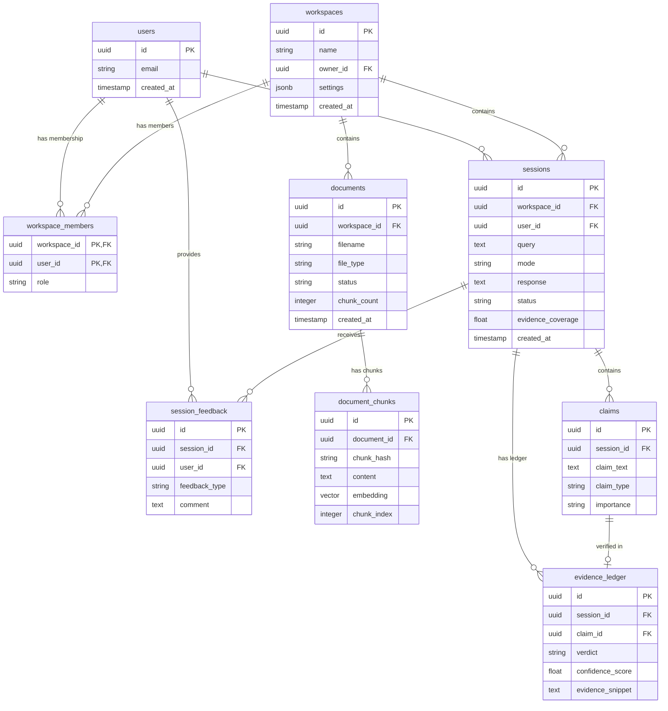

# Database Schema

> **Database:** PostgreSQL via Supabase
> **Extensions:** pgvector, uuid-ossp
> **Version:** 1.0
> **Last Updated:** 2026-01-03

---

## 1. Overview

VerityDraft uses Supabase (PostgreSQL) as its primary database with pgvector for embedding storage and similarity search.

---

## 2. Entity Relationship Diagram



---

## 3. Tables

### 3.1 workspaces

```sql
CREATE TABLE workspaces (
    id UUID PRIMARY KEY DEFAULT gen_random_uuid(),
    name TEXT NOT NULL,
    owner_id UUID NOT NULL REFERENCES auth.users(id),
    settings JSONB DEFAULT '{
        "default_mode": "answer",
        "strict_mode": false,
        "verification_mode": "verified"
    }'::jsonb,
    created_at TIMESTAMPTZ DEFAULT now(),
    updated_at TIMESTAMPTZ DEFAULT now()
);

CREATE INDEX idx_workspaces_owner ON workspaces(owner_id);

-- Trigger for updated_at
CREATE TRIGGER set_workspaces_updated_at
    BEFORE UPDATE ON workspaces
    FOR EACH ROW
    EXECUTE FUNCTION trigger_set_updated_at();
```

### 3.2 workspace_members

```sql
CREATE TABLE workspace_members (
    workspace_id UUID NOT NULL REFERENCES workspaces(id) ON DELETE CASCADE,
    user_id UUID NOT NULL REFERENCES auth.users(id) ON DELETE CASCADE,
    role TEXT NOT NULL CHECK (role IN ('owner', 'admin', 'member')),
    created_at TIMESTAMPTZ DEFAULT now(),
    PRIMARY KEY (workspace_id, user_id)
);

CREATE INDEX idx_workspace_members_user ON workspace_members(user_id);
```

### 3.3 documents

```sql
CREATE TABLE documents (
    id UUID PRIMARY KEY DEFAULT gen_random_uuid(),
    workspace_id UUID NOT NULL REFERENCES workspaces(id) ON DELETE CASCADE,
    filename TEXT NOT NULL,
    file_type TEXT NOT NULL CHECK (file_type IN ('pdf', 'docx')),
    file_size INTEGER,
    storage_path TEXT,

    -- User-provided metadata
    tags TEXT[] DEFAULT '{}',

    -- Inferred metadata
    metadata JSONB DEFAULT '{}'::jsonb,
    inferred_date DATE,
    inferred_version TEXT,

    -- Processing status
    status TEXT NOT NULL DEFAULT 'uploading'
        CHECK (status IN ('uploading', 'processing', 'ready', 'error')),
    error_message TEXT,
    chunk_count INTEGER DEFAULT 0,

    created_at TIMESTAMPTZ DEFAULT now(),
    updated_at TIMESTAMPTZ DEFAULT now()
);

CREATE INDEX idx_documents_workspace ON documents(workspace_id);
CREATE INDEX idx_documents_status ON documents(status);
CREATE INDEX idx_documents_tags ON documents USING GIN(tags);
```

### 3.4 document_chunks

```sql
-- Enable pgvector extension
CREATE EXTENSION IF NOT EXISTS vector;

CREATE TABLE document_chunks (
    id UUID PRIMARY KEY DEFAULT gen_random_uuid(),
    document_id UUID NOT NULL REFERENCES documents(id) ON DELETE CASCADE,

    -- Stable identifier for citations
    chunk_hash TEXT NOT NULL,

    -- Content
    content TEXT NOT NULL,

    -- Position in document
    chunk_index INTEGER NOT NULL,
    page_number INTEGER,
    heading_path TEXT[] DEFAULT '{}',

    -- Character offsets for highlighting
    start_offset INTEGER,
    end_offset INTEGER,

    -- Embedding (1536 dimensions for text-embedding-3-small)
    embedding vector(1536),

    -- Metadata
    metadata JSONB DEFAULT '{}'::jsonb,

    created_at TIMESTAMPTZ DEFAULT now(),

    UNIQUE(document_id, chunk_hash)
);

-- HNSW index for fast similarity search
CREATE INDEX idx_chunks_embedding ON document_chunks
    USING hnsw (embedding vector_cosine_ops)
    WITH (m = 16, ef_construction = 64);

CREATE INDEX idx_chunks_document ON document_chunks(document_id);
CREATE INDEX idx_chunks_hash ON document_chunks(chunk_hash);
```

### 3.5 sessions

```sql
CREATE TABLE sessions (
    id UUID PRIMARY KEY DEFAULT gen_random_uuid(),
    workspace_id UUID NOT NULL REFERENCES workspaces(id) ON DELETE CASCADE,
    user_id UUID NOT NULL REFERENCES auth.users(id),

    -- Query details
    query TEXT NOT NULL,
    mode TEXT NOT NULL CHECK (mode IN ('answer', 'draft')),
    settings JSONB DEFAULT '{}'::jsonb,

    -- Response
    response TEXT,

    -- Processing status
    status TEXT NOT NULL DEFAULT 'pending'
        CHECK (status IN ('pending', 'processing', 'completed', 'error')),
    error_message TEXT,

    -- Metrics
    processing_time_ms INTEGER,
    token_count JSONB,  -- { writer: X, skeptic: Y, judge: Z }
    evidence_coverage FLOAT,
    unsupported_claim_count INTEGER DEFAULT 0,
    revision_cycles INTEGER DEFAULT 0,

    created_at TIMESTAMPTZ DEFAULT now(),
    completed_at TIMESTAMPTZ
);

CREATE INDEX idx_sessions_workspace ON sessions(workspace_id);
CREATE INDEX idx_sessions_user ON sessions(user_id);
CREATE INDEX idx_sessions_created ON sessions(created_at DESC);
```

### 3.6 claims

```sql
CREATE TABLE claims (
    id UUID PRIMARY KEY DEFAULT gen_random_uuid(),
    session_id UUID NOT NULL REFERENCES sessions(id) ON DELETE CASCADE,

    -- Claim content
    claim_text TEXT NOT NULL,
    claim_type TEXT NOT NULL
        CHECK (claim_type IN ('fact', 'policy', 'numeric', 'definition')),
    importance TEXT NOT NULL
        CHECK (importance IN ('critical', 'material', 'minor')),
    requires_citation BOOLEAN DEFAULT true,

    -- Position in response
    start_offset INTEGER,
    end_offset INTEGER,

    created_at TIMESTAMPTZ DEFAULT now()
);

CREATE INDEX idx_claims_session ON claims(session_id);
```

### 3.7 evidence_ledger

```sql
CREATE TABLE evidence_ledger (
    id UUID PRIMARY KEY DEFAULT gen_random_uuid(),
    session_id UUID NOT NULL REFERENCES sessions(id) ON DELETE CASCADE,
    claim_id UUID NOT NULL REFERENCES claims(id) ON DELETE CASCADE,

    -- Verdict
    verdict TEXT NOT NULL
        CHECK (verdict IN ('supported', 'weak', 'contradicted', 'not_found')),
    confidence_score FLOAT CHECK (confidence_score >= 0 AND confidence_score <= 1),

    -- Evidence references
    chunk_ids UUID[] DEFAULT '{}',
    evidence_snippet TEXT,

    -- Reasoning
    notes TEXT,

    created_at TIMESTAMPTZ DEFAULT now(),

    UNIQUE(session_id, claim_id)
);

CREATE INDEX idx_ledger_session ON evidence_ledger(session_id);
CREATE INDEX idx_ledger_verdict ON evidence_ledger(verdict);
```

### 3.8 session_feedback

```sql
CREATE TABLE session_feedback (
    id UUID PRIMARY KEY DEFAULT gen_random_uuid(),
    session_id UUID NOT NULL REFERENCES sessions(id) ON DELETE CASCADE,
    user_id UUID NOT NULL REFERENCES auth.users(id),

    feedback_type TEXT NOT NULL
        CHECK (feedback_type IN ('helpful', 'incorrect', 'missing_citation')),
    comment TEXT,
    corrections JSONB,  -- Structured corrections

    created_at TIMESTAMPTZ DEFAULT now()
);

CREATE INDEX idx_feedback_session ON session_feedback(session_id);
```

---

## 4. Row-Level Security (RLS)

### 4.1 Enable RLS

```sql
ALTER TABLE workspaces ENABLE ROW LEVEL SECURITY;
ALTER TABLE workspace_members ENABLE ROW LEVEL SECURITY;
ALTER TABLE documents ENABLE ROW LEVEL SECURITY;
ALTER TABLE document_chunks ENABLE ROW LEVEL SECURITY;
ALTER TABLE sessions ENABLE ROW LEVEL SECURITY;
ALTER TABLE claims ENABLE ROW LEVEL SECURITY;
ALTER TABLE evidence_ledger ENABLE ROW LEVEL SECURITY;
ALTER TABLE session_feedback ENABLE ROW LEVEL SECURITY;
```

### 4.2 Policies

```sql
-- Workspace access policy
CREATE POLICY workspace_access ON workspaces
    FOR ALL
    USING (
        id IN (
            SELECT workspace_id
            FROM workspace_members
            WHERE user_id = auth.uid()
        )
    );

-- Workspace members access (user can see their own memberships)
CREATE POLICY workspace_members_access ON workspace_members
    FOR ALL
    USING (user_id = auth.uid());

-- Workspace members insert (owners/admins can add members)
CREATE POLICY workspace_members_insert ON workspace_members
    FOR INSERT
    WITH CHECK (
        workspace_id IN (
            SELECT workspace_id
            FROM workspace_members
            WHERE user_id = auth.uid()
            AND role IN ('owner', 'admin')
        )
    );

-- Workspace members delete (owners/admins can remove members)
CREATE POLICY workspace_members_delete ON workspace_members
    FOR DELETE
    USING (
        workspace_id IN (
            SELECT workspace_id
            FROM workspace_members
            WHERE user_id = auth.uid()
            AND role IN ('owner', 'admin')
        )
    );

-- Document access through workspace
CREATE POLICY document_access ON documents
    FOR ALL
    USING (
        workspace_id IN (
            SELECT workspace_id
            FROM workspace_members
            WHERE user_id = auth.uid()
        )
    );

-- Chunk access through document
CREATE POLICY chunk_access ON document_chunks
    FOR ALL
    USING (
        document_id IN (
            SELECT d.id
            FROM documents d
            JOIN workspace_members wm ON d.workspace_id = wm.workspace_id
            WHERE wm.user_id = auth.uid()
        )
    );

-- Session access
CREATE POLICY session_access ON sessions
    FOR ALL
    USING (
        workspace_id IN (
            SELECT workspace_id
            FROM workspace_members
            WHERE user_id = auth.uid()
        )
    );

-- Claims access through session
CREATE POLICY claims_access ON claims
    FOR ALL
    USING (
        session_id IN (
            SELECT s.id
            FROM sessions s
            JOIN workspace_members wm ON s.workspace_id = wm.workspace_id
            WHERE wm.user_id = auth.uid()
        )
    );

-- Evidence ledger access through session
CREATE POLICY evidence_ledger_access ON evidence_ledger
    FOR ALL
    USING (
        session_id IN (
            SELECT s.id
            FROM sessions s
            JOIN workspace_members wm ON s.workspace_id = wm.workspace_id
            WHERE wm.user_id = auth.uid()
        )
    );

-- Session feedback access (own feedback only for read, workspace for write)
CREATE POLICY session_feedback_read ON session_feedback
    FOR SELECT
    USING (user_id = auth.uid());

CREATE POLICY session_feedback_insert ON session_feedback
    FOR INSERT
    WITH CHECK (
        user_id = auth.uid()
        AND session_id IN (
            SELECT s.id
            FROM sessions s
            JOIN workspace_members wm ON s.workspace_id = wm.workspace_id
            WHERE wm.user_id = auth.uid()
        )
    );
```

---

## 5. Functions

### 5.1 Vector Similarity Search

```sql
CREATE OR REPLACE FUNCTION match_chunks(
    query_embedding vector(1536),
    workspace_id_param UUID,
    match_threshold FLOAT DEFAULT 0.7,
    match_count INT DEFAULT 10
)
RETURNS TABLE (
    chunk_id UUID,
    document_id UUID,
    chunk_hash TEXT,
    content TEXT,
    heading_path TEXT[],
    page_number INT,
    similarity FLOAT
)
LANGUAGE sql STABLE
SECURITY DEFINER
AS $$
    SELECT
        dc.id as chunk_id,
        dc.document_id,
        dc.chunk_hash,
        dc.content,
        dc.heading_path,
        dc.page_number,
        1 - (dc.embedding <=> query_embedding) as similarity
    FROM document_chunks dc
    JOIN documents d ON dc.document_id = d.id
    WHERE d.workspace_id = workspace_id_param
        AND d.status = 'ready'
        AND 1 - (dc.embedding <=> query_embedding) > match_threshold
    ORDER BY dc.embedding <=> query_embedding
    LIMIT match_count;
$$;
```

### 5.2 Updated At Trigger

```sql
CREATE OR REPLACE FUNCTION trigger_set_updated_at()
RETURNS TRIGGER AS $$
BEGIN
    NEW.updated_at = now();
    RETURN NEW;
END;
$$ LANGUAGE plpgsql;
```

---

## 6. Migrations

### 6.1 Initial Migration

```sql
-- 001_initial_schema.sql
-- Run all CREATE TABLE statements above

-- Enable extensions
CREATE EXTENSION IF NOT EXISTS vector;
CREATE EXTENSION IF NOT EXISTS "uuid-ossp";
```

### 6.2 Adding Indexes

```sql
-- 002_add_indexes.sql
-- Create all indexes defined above
```

### 6.3 Enable RLS

```sql
-- 003_enable_rls.sql
-- Enable RLS and create policies
```

---

## 7. Backup & Recovery

### 7.1 Backup Strategy

| Data | Frequency | Retention |
|------|-----------|-----------|
| Full database | Daily | 30 days |
| WAL logs | Continuous | 7 days |
| Document files | Continuous (S3) | Until deleted |

### 7.2 Point-in-Time Recovery

Supabase provides automatic point-in-time recovery (PITR) for Pro plans, allowing restoration to any point within the retention window.
