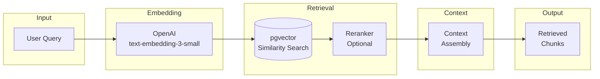

# RAG Pipeline

> **Version:** 1.0
> **Last Updated:** 2026-01-03

---

## 1. Overview

The Retrieval-Augmented Generation (RAG) pipeline retrieves relevant document chunks to provide context for LLM generation, ensuring responses are grounded in source documents.

---

## 2. Pipeline Architecture



---

## 3. Query Processing

### 3.1 Query Preprocessing

```typescript
function preprocessQuery(query: string): string {
  return query
    .trim()
    .replace(/\s+/g, ' ')           // Normalize whitespace
    .replace(/[^\w\s?.,!-]/g, '')   // Remove special chars
    .slice(0, 2000);                 // Limit length
}
```

### 3.2 Query Embedding

```typescript
import OpenAI from 'openai';

const openai = new OpenAI({ apiKey: process.env.OPENAI_API_KEY });

async function generateQueryEmbedding(query: string): Promise<number[]> {
  const response = await openai.embeddings.create({
    model: "text-embedding-3-small",
    input: preprocessQuery(query),
    dimensions: 1536
  });

  return response.data[0].embedding;
}
```

---

## 4. Vector Search

### 4.1 Similarity Search

```typescript
interface RetrievalOptions {
  workspaceId: string;
  documentIds?: string[];      // Optional filter
  threshold: number;           // Default: 0.7
  limit: number;               // Default: 10
}

async function searchChunks(
  embedding: number[],
  options: RetrievalOptions
): Promise<RetrievedChunk[]> {
  const { data } = await supabase.rpc('match_chunks', {
    query_embedding: embedding,
    workspace_id_param: options.workspaceId,
    match_threshold: options.threshold,
    match_count: options.limit
  });

  // Filter by specific documents if provided
  if (options.documentIds?.length) {
    return data.filter(chunk =>
      options.documentIds.includes(chunk.document_id)
    );
  }

  return data;
}
```

### 4.2 Retrieval Parameters

| Parameter | Default | Range | Notes |
|-----------|---------|-------|-------|
| threshold | 0.7 | 0.5 - 0.9 | Lower = more results, less relevant |
| limit | 10 | 5 - 20 | Max chunks to retrieve |
| dimensions | 1536 | - | Fixed by embedding model |

---

## 5. Reranking (Optional)

### 5.1 Cross-Encoder Reranking

```typescript
async function rerankChunks(
  query: string,
  chunks: RetrievedChunk[],
  topK: number = 8
): Promise<RetrievedChunk[]> {
  // Use LLM to rerank for relevance
  const prompt = `
    Query: ${query}

    Rank these document excerpts by relevance (1 = most relevant):
    ${chunks.map((c, i) => `[${i}] ${c.content.slice(0, 200)}...`).join('\n')}

    Return JSON: { "ranking": [index1, index2, ...] }
  `;

  const response = await llm.complete(prompt);
  const { ranking } = JSON.parse(response);

  return ranking.slice(0, topK).map(i => chunks[i]);
}
```

### 5.2 When to Rerank

| Scenario | Rerank? | Reason |
|----------|---------|--------|
| Simple factual query | No | Embeddings sufficient |
| Complex multi-part query | Yes | Better relevance matching |
| Draft generation | Yes | Need best evidence |
| Fast mode | No | Skip for speed |

---

## 6. Context Assembly

### 6.1 Context Window

```typescript
interface ContextWindow {
  chunks: FormattedChunk[];
  totalTokens: number;
  sources: SourceReference[];
}

function assembleContext(
  chunks: RetrievedChunk[],
  maxTokens: number = 50000
): ContextWindow {
  const formatted: FormattedChunk[] = [];
  let tokenCount = 0;

  for (const chunk of chunks) {
    const chunkTokens = estimateTokens(chunk.content);

    if (tokenCount + chunkTokens > maxTokens) break;

    formatted.push({
      id: chunk.chunk_hash,
      content: chunk.content,
      source: `${chunk.filename}, Page ${chunk.page_number}`,
      heading: chunk.heading_path.join(' > ')
    });

    tokenCount += chunkTokens;
  }

  return {
    chunks: formatted,
    totalTokens: tokenCount,
    sources: extractSources(formatted)
  };
}
```

### 6.2 Context Format for LLM

```typescript
function formatContextForLLM(context: ContextWindow): string {
  return `## Source Documents

${context.chunks.map(c => `
### [${c.id}] ${c.source}
${c.heading ? `Section: ${c.heading}` : ''}

${c.content}
`).join('\n---\n')}

## Citation Instructions
When citing, use [cite:CHUNK_ID] format, e.g., [cite:${context.chunks[0]?.id}]
`;
}
```

---

## 7. Caching

### 7.1 Embedding Cache

```typescript
const embeddingCache = new Map<string, {
  embedding: number[];
  timestamp: number;
}>();

const CACHE_TTL = 60 * 60 * 1000; // 1 hour

async function getQueryEmbedding(query: string): Promise<number[]> {
  const cacheKey = hashQuery(query);
  const cached = embeddingCache.get(cacheKey);

  if (cached && Date.now() - cached.timestamp < CACHE_TTL) {
    return cached.embedding;
  }

  const embedding = await generateQueryEmbedding(query);
  embeddingCache.set(cacheKey, {
    embedding,
    timestamp: Date.now()
  });

  return embedding;
}
```

### 7.2 Retrieval Cache

```typescript
const retrievalCache = new Map<string, {
  chunks: RetrievedChunk[];
  timestamp: number;
}>();

const RETRIEVAL_TTL = 5 * 60 * 1000; // 5 minutes

function getCacheKey(embedding: number[], workspaceId: string): string {
  return `${workspaceId}:${hashEmbedding(embedding)}`;
}
```

---

## 8. Performance Optimization

### 8.1 HNSW Index Tuning

```sql
-- Optimize for search quality vs speed
CREATE INDEX idx_chunks_embedding ON document_chunks
    USING hnsw (embedding vector_cosine_ops)
    WITH (
        m = 16,                 -- Max connections per node
        ef_construction = 64    -- Build-time search depth
    );

-- At query time, set search depth
SET hnsw.ef_search = 40;  -- Higher = more accurate, slower
```

### 8.2 Parallel Retrieval

```typescript
async function parallelRetrieval(
  query: string,
  workspaceId: string
): Promise<RetrievedChunk[]> {
  // Generate embedding and search in parallel
  const [embedding] = await Promise.all([
    getQueryEmbedding(query),
    // Warm up connection pool
    warmupDatabase()
  ]);

  return searchChunks(embedding, { workspaceId, limit: 12 });
}
```

---

## 9. Metrics

### 9.1 Retrieval Quality

| Metric | Target | Measurement |
|--------|--------|-------------|
| Recall@10 | > 80% | % relevant docs in top 10 |
| MRR | > 0.7 | Mean reciprocal rank |
| Latency | < 200ms | P95 search time |

### 9.2 Logging

```typescript
function logRetrieval(params: {
  sessionId: string;
  queryLength: number;
  chunksRetrieved: number;
  avgSimilarity: number;
  latencyMs: number;
}) {
  console.log(JSON.stringify({
    event: "retrieval_complete",
    ...params,
    timestamp: new Date().toISOString()
  }));
}
```

---

## 10. Error Handling

```typescript
async function safeRetrieval(
  query: string,
  workspaceId: string
): Promise<RetrievalResult> {
  try {
    const embedding = await getQueryEmbedding(query);
    const chunks = await searchChunks(embedding, { workspaceId });

    if (chunks.length === 0) {
      return {
        success: true,
        chunks: [],
        warning: "No matching documents found"
      };
    }

    return { success: true, chunks };

  } catch (error) {
    if (error.code === 'EMBEDDING_FAILED') {
      // Fallback to keyword search
      return keywordFallback(query, workspaceId);
    }

    return {
      success: false,
      error: error.message
    };
  }
}
```
