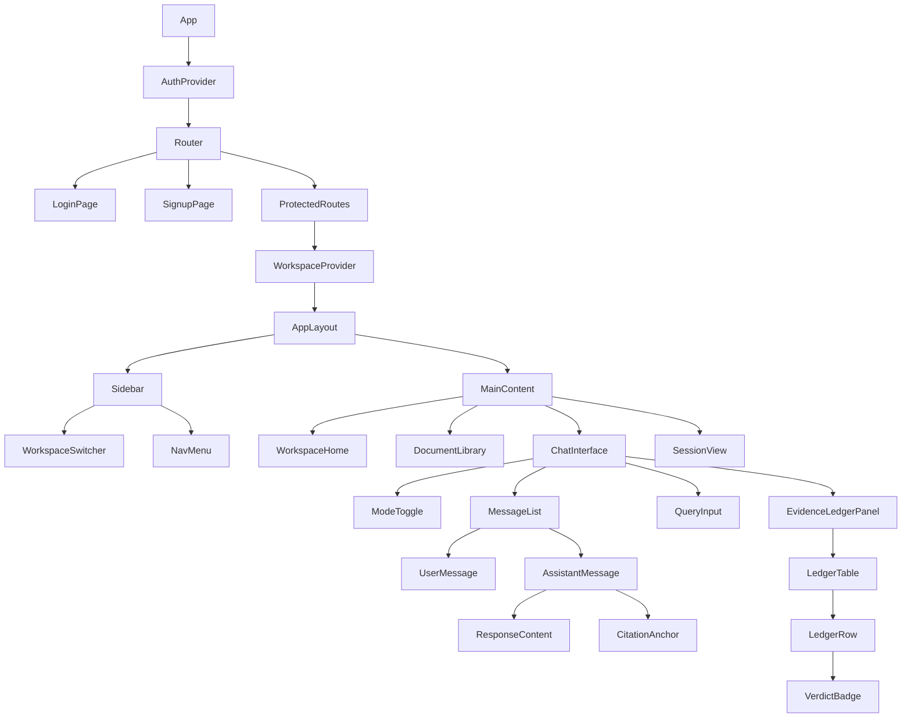

# Frontend Architecture

> **Framework:** React 18+ with TypeScript
> **Bundler:** Bun HTML Imports
> **Styling:** Tailwind CSS
> **Version:** 1.0

---

## 1. Technology Stack

| Layer | Technology |
|-------|------------|
| Runtime | Bun |
| Framework | React 18 |
| Language | TypeScript |
| Styling | Tailwind CSS |
| State | React Context + React Query |
| Routing | React Router v6 |
| Icons | Lucide React |

---

## 2. Project Structure

```
src/
├── index.html              # Entry point with Bun HTML imports
├── frontend.tsx            # React app bootstrap
├── components/
│   ├── auth/
│   │   ├── LoginForm.tsx
│   │   ├── SignupForm.tsx
│   │   └── AuthGuard.tsx
│   ├── layout/
│   │   ├── AppLayout.tsx
│   │   ├── Sidebar.tsx
│   │   └── Header.tsx
│   ├── workspace/
│   │   ├── WorkspaceSwitcher.tsx
│   │   └── WorkspaceHome.tsx
│   ├── documents/
│   │   ├── DocumentLibrary.tsx
│   │   ├── DocumentUpload.tsx
│   │   ├── DocumentCard.tsx
│   │   └── ChunkViewer.tsx
│   ├── chat/
│   │   ├── ChatInterface.tsx
│   │   ├── MessageList.tsx
│   │   ├── QueryInput.tsx
│   │   └── ModeToggle.tsx
│   ├── evidence/
│   │   ├── EvidenceLedgerPanel.tsx
│   │   ├── LedgerTable.tsx
│   │   ├── VerdictBadge.tsx
│   │   └── CitationAnchor.tsx
│   └── ui/
│       ├── Button.tsx
│       ├── Input.tsx
│       ├── Modal.tsx
│       └── Spinner.tsx
├── hooks/
│   ├── useAuth.ts
│   ├── useWorkspace.ts
│   ├── useDocuments.ts
│   ├── useSessions.ts
│   └── useWebSocket.ts
├── contexts/
│   ├── AuthContext.tsx
│   ├── WorkspaceContext.tsx
│   └── ThemeContext.tsx
├── services/
│   ├── api.ts
│   ├── supabase.ts
│   └── websocket.ts
├── types/
│   └── index.ts
└── utils/
    ├── formatting.ts
    └── citations.ts
```

---

## 3. Component Hierarchy



---

## 4. Entry Point

### 4.1 index.html

```html
<!DOCTYPE html>
<html lang="en">
<head>
  <meta charset="UTF-8">
  <meta name="viewport" content="width=device-width, initial-scale=1.0">
  <title>VerityDraft</title>
  <link rel="stylesheet" href="./styles/main.css">
</head>
<body>
  <div id="root"></div>
  <script type="module" src="./frontend.tsx"></script>
</body>
</html>
```

### 4.2 frontend.tsx

```tsx
import React from 'react';
import { createRoot } from 'react-dom/client';
import { BrowserRouter } from 'react-router-dom';
import { QueryClient, QueryClientProvider } from '@tanstack/react-query';

import { AuthProvider } from './contexts/AuthContext';
import { ThemeProvider } from './contexts/ThemeContext';
import App from './App';

import './styles/main.css';

const queryClient = new QueryClient({
  defaultOptions: {
    queries: {
      staleTime: 5 * 60 * 1000,
      retry: 1,
    },
  },
});

const root = createRoot(document.getElementById('root')!);

root.render(
  <React.StrictMode>
    <QueryClientProvider client={queryClient}>
      <BrowserRouter>
        <ThemeProvider>
          <AuthProvider>
            <App />
          </AuthProvider>
        </ThemeProvider>
      </BrowserRouter>
    </QueryClientProvider>
  </React.StrictMode>
);
```

---

## 5. Key Components

### 5.1 ChatInterface

```tsx
interface ChatInterfaceProps {
  workspaceId: string;
}

export function ChatInterface({ workspaceId }: ChatInterfaceProps) {
  const [mode, setMode] = useState<'answer' | 'draft'>('answer');
  const [query, setQuery] = useState('');
  const [isStreaming, setIsStreaming] = useState(false);

  const { sendQuery, response, ledger, isLoading } = useQuery(workspaceId);

  const handleSubmit = async () => {
    if (!query.trim()) return;

    setIsStreaming(true);
    await sendQuery({ query, mode });
    setIsStreaming(false);
  };

  return (
    <div className="flex flex-col h-full">
      <ChatHeader>
        <ModeToggle mode={mode} onChange={setMode} />
        <SettingsButton />
      </ChatHeader>

      <MessageList
        messages={messages}
        isStreaming={isStreaming}
      />

      <div className="flex gap-4 p-4">
        <div className="flex-1">
          <QueryInput
            value={query}
            onChange={setQuery}
            onSubmit={handleSubmit}
            disabled={isLoading}
          />
        </div>
        {ledger && (
          <EvidenceLedgerPanel ledger={ledger} />
        )}
      </div>
    </div>
  );
}
```

### 5.2 EvidenceLedgerPanel

```tsx
interface EvidenceLedgerPanelProps {
  ledger: EvidenceLedger;
  onClaimClick?: (claimId: string) => void;
}

export function EvidenceLedgerPanel({
  ledger,
  onClaimClick
}: EvidenceLedgerPanelProps) {
  return (
    <div className="w-96 border-l bg-gray-50">
      <div className="p-4 border-b">
        <h3 className="font-semibold">Evidence Ledger</h3>
        <LedgerSummary summary={ledger.summary} />
      </div>

      <div className="overflow-y-auto">
        <LedgerTable
          entries={ledger.entries}
          onRowClick={onClaimClick}
        />
      </div>

      {ledger.risk_flags.length > 0 && (
        <RiskFlagsSection flags={ledger.risk_flags} />
      )}
    </div>
  );
}
```

### 5.3 VerdictBadge

```tsx
const verdictStyles = {
  supported: 'bg-green-100 text-green-800 border-green-200',
  weak: 'bg-amber-100 text-amber-800 border-amber-200',
  contradicted: 'bg-red-100 text-red-800 border-red-200',
  not_found: 'bg-gray-100 text-gray-800 border-gray-200',
};

const verdictIcons = {
  supported: CheckCircle,
  weak: AlertCircle,
  contradicted: XCircle,
  not_found: HelpCircle,
};

export function VerdictBadge({ verdict }: { verdict: Verdict }) {
  const Icon = verdictIcons[verdict];

  return (
    <span className={`
      inline-flex items-center gap-1 px-2 py-0.5
      text-xs font-medium rounded-full border
      ${verdictStyles[verdict]}
    `}>
      <Icon className="w-3 h-3" />
      {verdict.replace('_', ' ')}
    </span>
  );
}
```

---

## 6. State Management

### 6.1 Auth Context

```tsx
interface AuthContextValue {
  user: User | null;
  session: Session | null;
  isLoading: boolean;
  signIn: (email: string, password: string) => Promise<void>;
  signUp: (email: string, password: string) => Promise<void>;
  signOut: () => Promise<void>;
}

export const AuthContext = createContext<AuthContextValue | null>(null);

export function AuthProvider({ children }: { children: ReactNode }) {
  const [user, setUser] = useState<User | null>(null);
  const [session, setSession] = useState<Session | null>(null);
  const [isLoading, setIsLoading] = useState(true);

  useEffect(() => {
    supabase.auth.getSession().then(({ data: { session } }) => {
      setSession(session);
      setUser(session?.user ?? null);
      setIsLoading(false);
    });

    const { data: { subscription } } = supabase.auth.onAuthStateChange(
      (_event, session) => {
        setSession(session);
        setUser(session?.user ?? null);
      }
    );

    return () => subscription.unsubscribe();
  }, []);

  // ... auth methods

  return (
    <AuthContext.Provider value={{ user, session, isLoading, signIn, signUp, signOut }}>
      {children}
    </AuthContext.Provider>
  );
}
```

### 6.2 React Query Hooks

```tsx
export function useDocuments(workspaceId: string) {
  return useQuery({
    queryKey: ['documents', workspaceId],
    queryFn: () => api.getDocuments(workspaceId),
    staleTime: 5 * 60 * 1000,
  });
}

export function useUploadDocument(workspaceId: string) {
  const queryClient = useQueryClient();

  return useMutation({
    mutationFn: (file: File) => api.uploadDocument(workspaceId, file),
    onSuccess: () => {
      queryClient.invalidateQueries(['documents', workspaceId]);
    },
  });
}
```

---

## 7. WebSocket Integration

```tsx
export function useQueryWebSocket(workspaceId: string) {
  const [response, setResponse] = useState('');
  const [ledger, setLedger] = useState<EvidenceLedger | null>(null);
  const [isLoading, setIsLoading] = useState(false);

  const ws = useRef<WebSocket | null>(null);

  const connect = useCallback(() => {
    ws.current = new WebSocket(`${WS_URL}?token=${getToken()}`);

    ws.current.onmessage = (event) => {
      const message = JSON.parse(event.data);

      switch (message.type) {
        case 'content_chunk':
          setResponse(prev => prev + message.payload.delta);
          break;
        case 'ledger_updated':
          setLedger(message.payload);
          break;
        case 'generation_complete':
          setIsLoading(false);
          break;
      }
    };
  }, []);

  const sendQuery = useCallback((params: QueryParams) => {
    setResponse('');
    setLedger(null);
    setIsLoading(true);

    ws.current?.send(JSON.stringify({
      type: 'query',
      payload: { workspace_id: workspaceId, ...params }
    }));
  }, [workspaceId]);

  return { connect, sendQuery, response, ledger, isLoading };
}
```

---

## 8. Routing

```tsx
export function AppRoutes() {
  return (
    <Routes>
      <Route path="/login" element={<LoginPage />} />
      <Route path="/signup" element={<SignupPage />} />

      <Route element={<ProtectedRoute />}>
        <Route element={<AppLayout />}>
          <Route path="/" element={<Navigate to="/workspaces" replace />} />
          <Route path="/workspaces" element={<WorkspaceList />} />
          <Route path="/workspaces/:id" element={<WorkspaceHome />} />
          <Route path="/workspaces/:id/documents" element={<DocumentLibrary />} />
          <Route path="/workspaces/:id/chat" element={<ChatInterface />} />
          <Route path="/sessions/:id" element={<SessionView />} />
        </Route>
      </Route>
    </Routes>
  );
}
```
