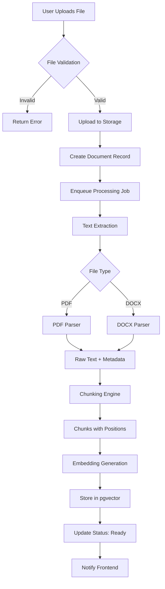
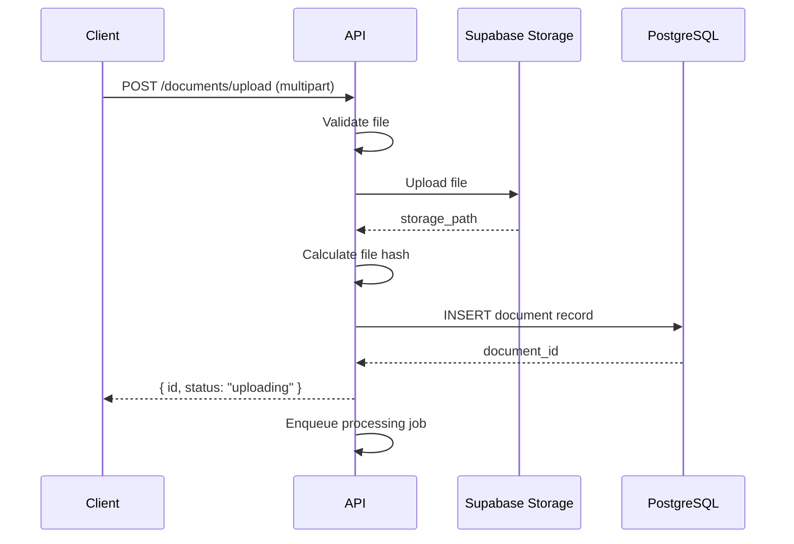
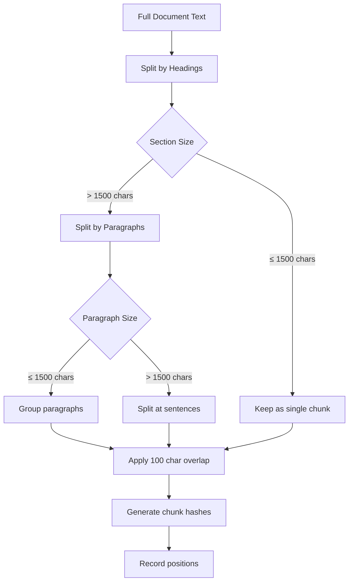
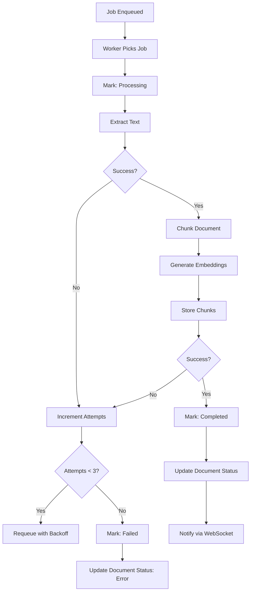
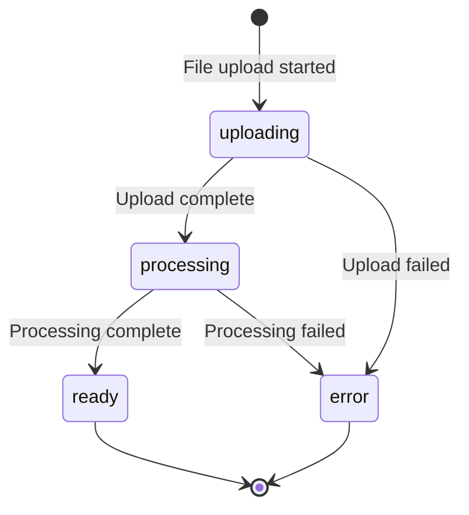

# Document Ingestion Workflow

> **Version:** 1.0
> **Last Updated:** 2026-01-03

---

## 1. Overview

Document ingestion is the process of uploading, parsing, chunking, and embedding documents to make them searchable for the RAG pipeline.

---

## 2. Ingestion Pipeline



---

## 3. File Validation

### 3.1 Validation Rules

| Check | Criteria | Error Message |
|-------|----------|---------------|
| File type | .pdf, .docx | "Only PDF and DOCX files are supported" |
| File size | ≤ 50 MB | "File exceeds 50MB limit" |
| File name | Non-empty, valid chars | "Invalid filename" |
| Duplicate | Same hash not exists | "Document already uploaded" |

### 3.2 Validation Implementation

```typescript
interface ValidationResult {
  valid: boolean;
  error?: string;
}

function validateFile(file: File): ValidationResult {
  const allowedTypes = ['application/pdf', 'application/vnd.openxmlformats-officedocument.wordprocessingml.document'];
  const maxSize = 50 * 1024 * 1024; // 50 MB

  if (!allowedTypes.includes(file.type)) {
    return { valid: false, error: 'Only PDF and DOCX files are supported' };
  }

  if (file.size > maxSize) {
    return { valid: false, error: 'File exceeds 50MB limit' };
  }

  if (!file.name || file.name.length > 255) {
    return { valid: false, error: 'Invalid filename' };
  }

  return { valid: true };
}
```

---

## 4. File Upload

### 4.1 Upload Flow



### 4.2 Storage Structure

```
bucket: veritydraft-documents
├── {workspace_id}/
│   ├── {document_id}/
│   │   ├── original.pdf
│   │   └── metadata.json
```

---

## 5. Text Extraction

### 5.1 PDF Extraction

```typescript
import { PDFExtract } from 'pdf.js-extract';

interface ExtractedPage {
  pageNumber: number;
  content: string;
  metadata: {
    width: number;
    height: number;
  };
}

async function extractPDF(filePath: string): Promise<ExtractedPage[]> {
  const pdfExtract = new PDFExtract();
  const data = await pdfExtract.extract(filePath);

  return data.pages.map((page, index) => ({
    pageNumber: index + 1,
    content: page.content
      .map(item => item.str)
      .join(' ')
      .replace(/\s+/g, ' ')
      .trim(),
    metadata: {
      width: page.width,
      height: page.height,
    },
  }));
}
```

### 5.2 DOCX Extraction

```typescript
import mammoth from 'mammoth';

interface ExtractedDocument {
  content: string;
  headings: Heading[];
  metadata: DocumentMetadata;
}

async function extractDOCX(filePath: string): Promise<ExtractedDocument> {
  const result = await mammoth.extractRawText({ path: filePath });

  // Extract headings for structure
  const headingResult = await mammoth.convertToHtml({ path: filePath });
  const headings = parseHeadings(headingResult.value);

  return {
    content: result.value,
    headings,
    metadata: extractDocxMetadata(filePath),
  };
}
```

### 5.3 Metadata Extraction

```typescript
interface DocumentMetadata {
  title?: string;
  author?: string;
  createdDate?: Date;
  modifiedDate?: Date;
  pageCount?: number;
  wordCount: number;
}

function extractMetadata(content: string, fileType: string): DocumentMetadata {
  return {
    wordCount: content.split(/\s+/).length,
    // Additional metadata from file properties
  };
}
```

---

## 6. Chunking Strategy

### 6.1 Chunking Algorithm



### 6.2 Chunking Implementation

```typescript
interface ChunkConfig {
  maxChunkSize: number;      // 1500 characters
  overlapSize: number;       // 100 characters
  minChunkSize: number;      // 100 characters
}

interface Chunk {
  content: string;
  chunkIndex: number;
  pageNumber?: number;
  headingPath: string[];
  startOffset: number;
  endOffset: number;
  chunkHash: string;
}

function chunkDocument(
  text: string,
  headings: Heading[],
  config: ChunkConfig
): Chunk[] {
  const chunks: Chunk[] = [];
  let chunkIndex = 0;

  // Split by sections (headings)
  const sections = splitBySections(text, headings);

  for (const section of sections) {
    if (section.content.length <= config.maxChunkSize) {
      chunks.push(createChunk(section, chunkIndex++));
    } else {
      // Split large sections by paragraphs
      const paragraphs = section.content.split(/\n\n+/);
      let currentChunk = '';
      let startOffset = section.startOffset;

      for (const para of paragraphs) {
        if (currentChunk.length + para.length > config.maxChunkSize) {
          if (currentChunk.length >= config.minChunkSize) {
            chunks.push({
              content: currentChunk.trim(),
              chunkIndex: chunkIndex++,
              headingPath: section.headingPath,
              startOffset,
              endOffset: startOffset + currentChunk.length,
              chunkHash: generateHash(currentChunk),
            });
          }

          // Start new chunk with overlap
          const overlap = currentChunk.slice(-config.overlapSize);
          currentChunk = overlap + para;
          startOffset = startOffset + currentChunk.length - overlap.length;
        } else {
          currentChunk += '\n\n' + para;
        }
      }

      // Add remaining content
      if (currentChunk.length >= config.minChunkSize) {
        chunks.push({
          content: currentChunk.trim(),
          chunkIndex: chunkIndex++,
          headingPath: section.headingPath,
          startOffset,
          endOffset: startOffset + currentChunk.length,
          chunkHash: generateHash(currentChunk),
        });
      }
    }
  }

  return chunks;
}
```

### 6.3 Chunk Hash Generation

```typescript
import { createHash } from 'crypto';

function generateChunkHash(content: string): string {
  const normalized = content
    .toLowerCase()
    .replace(/\s+/g, ' ')
    .trim();

  return createHash('sha256')
    .update(normalized)
    .digest('hex')
    .slice(0, 12);
}
```

---

## 7. Embedding Generation

### 7.1 Batch Embedding

```typescript
import OpenAI from 'openai';

const openai = new OpenAI({ apiKey: process.env.OPENAI_API_KEY });

const BATCH_SIZE = 100;
const EMBEDDING_MODEL = 'text-embedding-3-small';
const DIMENSIONS = 1536;

async function generateEmbeddings(chunks: Chunk[]): Promise<ChunkWithEmbedding[]> {
  const results: ChunkWithEmbedding[] = [];

  // Process in batches
  for (let i = 0; i < chunks.length; i += BATCH_SIZE) {
    const batch = chunks.slice(i, i + BATCH_SIZE);
    const texts = batch.map(c => c.content);

    const response = await openai.embeddings.create({
      model: EMBEDDING_MODEL,
      input: texts,
      dimensions: DIMENSIONS,
    });

    for (let j = 0; j < batch.length; j++) {
      results.push({
        ...batch[j],
        embedding: response.data[j].embedding,
      });
    }
  }

  return results;
}
```

### 7.2 Embedding Storage

```typescript
async function storeChunks(
  documentId: string,
  chunks: ChunkWithEmbedding[]
): Promise<void> {
  const { error } = await supabase
    .from('document_chunks')
    .insert(
      chunks.map(chunk => ({
        document_id: documentId,
        chunk_hash: chunk.chunkHash,
        content: chunk.content,
        chunk_index: chunk.chunkIndex,
        page_number: chunk.pageNumber,
        heading_path: chunk.headingPath,
        start_offset: chunk.startOffset,
        end_offset: chunk.endOffset,
        embedding: chunk.embedding,
      }))
    );

  if (error) throw error;
}
```

---

## 8. Processing Queue

### 8.1 Job Structure

```typescript
interface ProcessingJob {
  id: string;
  documentId: string;
  workspaceId: string;
  storagePath: string;
  fileType: 'pdf' | 'docx';
  status: 'pending' | 'processing' | 'completed' | 'failed';
  attempts: number;
  error?: string;
  createdAt: Date;
  startedAt?: Date;
  completedAt?: Date;
}
```

### 8.2 Job Processing



### 8.3 Worker Implementation

```typescript
async function processDocument(job: ProcessingJob): Promise<void> {
  try {
    // Update status
    await updateJobStatus(job.id, 'processing');

    // Download file
    const fileBuffer = await downloadFromStorage(job.storagePath);

    // Extract text based on file type
    const extracted = job.fileType === 'pdf'
      ? await extractPDF(fileBuffer)
      : await extractDOCX(fileBuffer);

    // Chunk the document
    const chunks = chunkDocument(extracted.content, extracted.headings, {
      maxChunkSize: 1500,
      overlapSize: 100,
      minChunkSize: 100,
    });

    // Generate embeddings
    const chunksWithEmbeddings = await generateEmbeddings(chunks);

    // Store in database
    await storeChunks(job.documentId, chunksWithEmbeddings);

    // Update document status
    await updateDocumentStatus(job.documentId, 'ready', chunks.length);

    // Notify frontend
    await notifyDocumentReady(job.workspaceId, job.documentId);

  } catch (error) {
    await handleProcessingError(job, error);
  }
}
```

---

## 9. Status Updates

### 9.1 Document States



### 9.2 WebSocket Notifications

```typescript
// Events sent to frontend
interface DocumentEvent {
  type: 'document_status_changed';
  payload: {
    documentId: string;
    status: 'uploading' | 'processing' | 'ready' | 'error';
    chunkCount?: number;
    error?: string;
  };
}

async function notifyDocumentReady(
  workspaceId: string,
  documentId: string
): Promise<void> {
  await broadcast(workspaceId, {
    type: 'document_status_changed',
    payload: {
      documentId,
      status: 'ready',
      chunkCount: await getChunkCount(documentId),
    },
  });
}
```

---

## 10. Error Handling

### 10.1 Error Types

| Error | Cause | Recovery |
|-------|-------|----------|
| EXTRACTION_FAILED | Corrupted/encrypted file | Mark failed, notify user |
| EMBEDDING_FAILED | OpenAI API error | Retry with backoff |
| STORAGE_FAILED | Supabase error | Retry with backoff |
| TIMEOUT | Processing too slow | Split into smaller jobs |

### 10.2 Retry Strategy

```typescript
const RETRY_CONFIG = {
  maxAttempts: 3,
  baseDelayMs: 1000,
  maxDelayMs: 30000,
};

function calculateBackoff(attempt: number): number {
  const delay = RETRY_CONFIG.baseDelayMs * Math.pow(2, attempt - 1);
  return Math.min(delay, RETRY_CONFIG.maxDelayMs);
}
```

---

## 11. Performance Metrics

| Metric | Target | Measurement |
|--------|--------|-------------|
| Upload throughput | < 5s for 10MB | Time to storage confirmation |
| Processing time | < 30s per document | Time from upload to ready |
| Embedding latency | < 100ms per chunk | OpenAI API response time |
| Chunk density | 500-1500 chars | Average chunk size |
