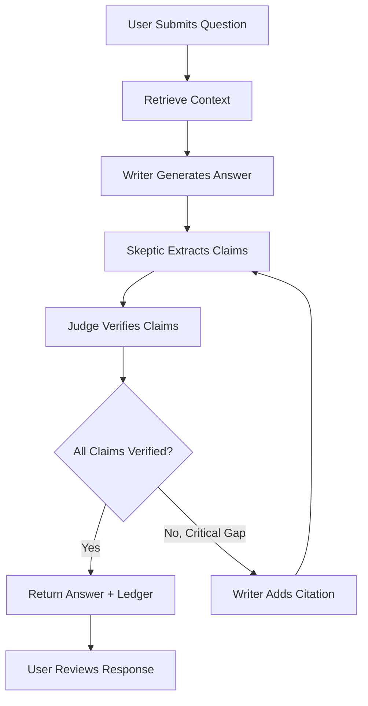
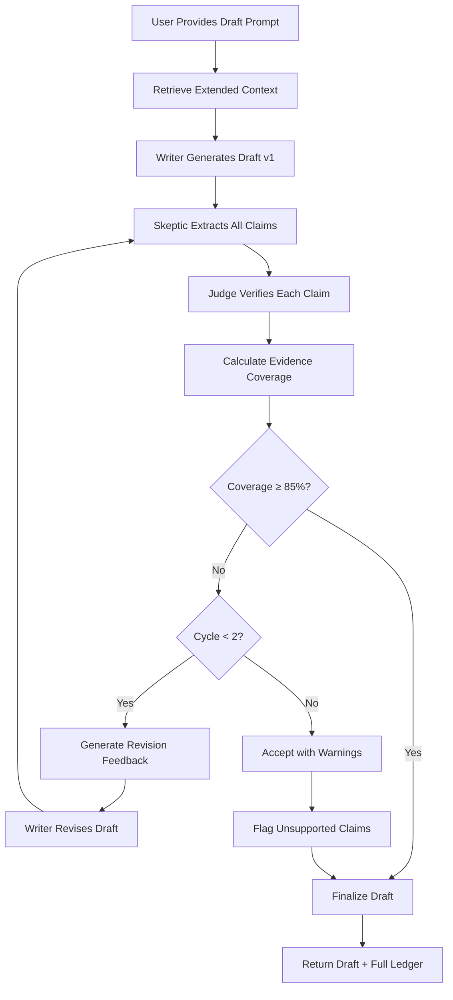
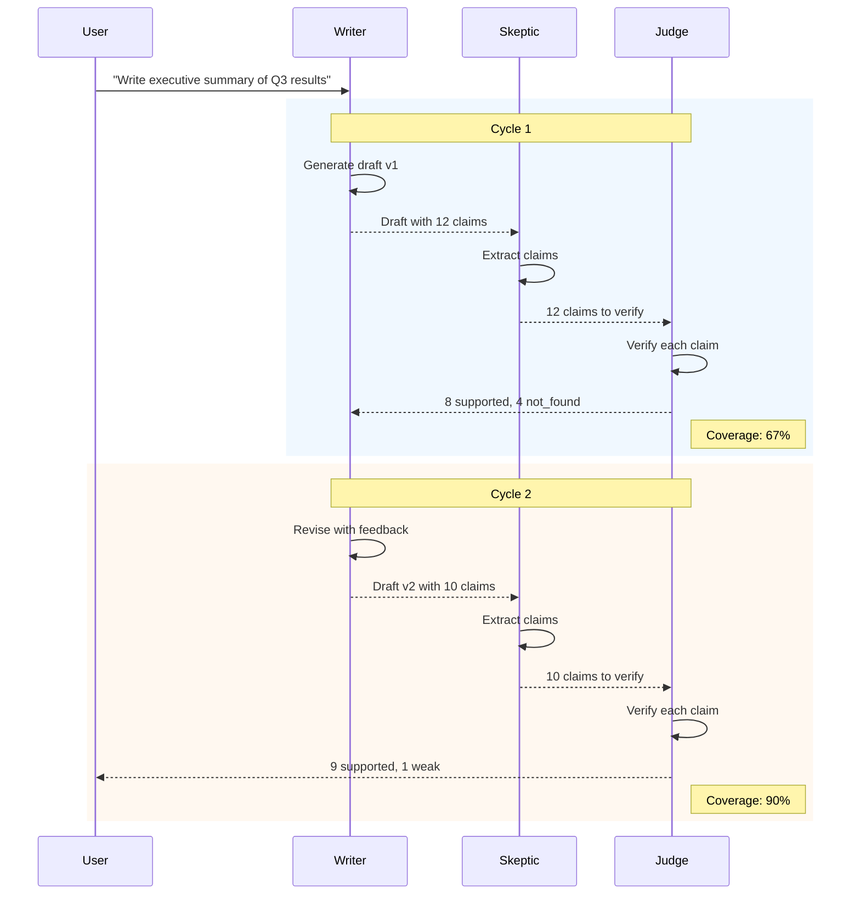
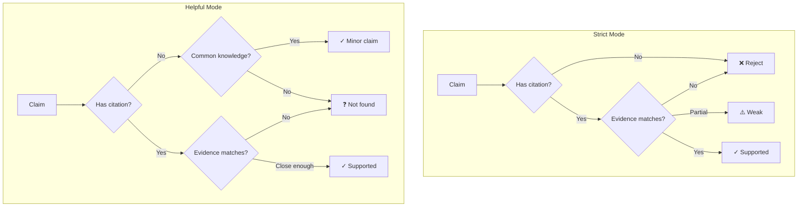
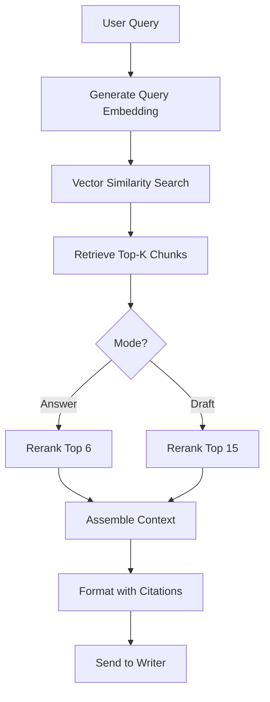
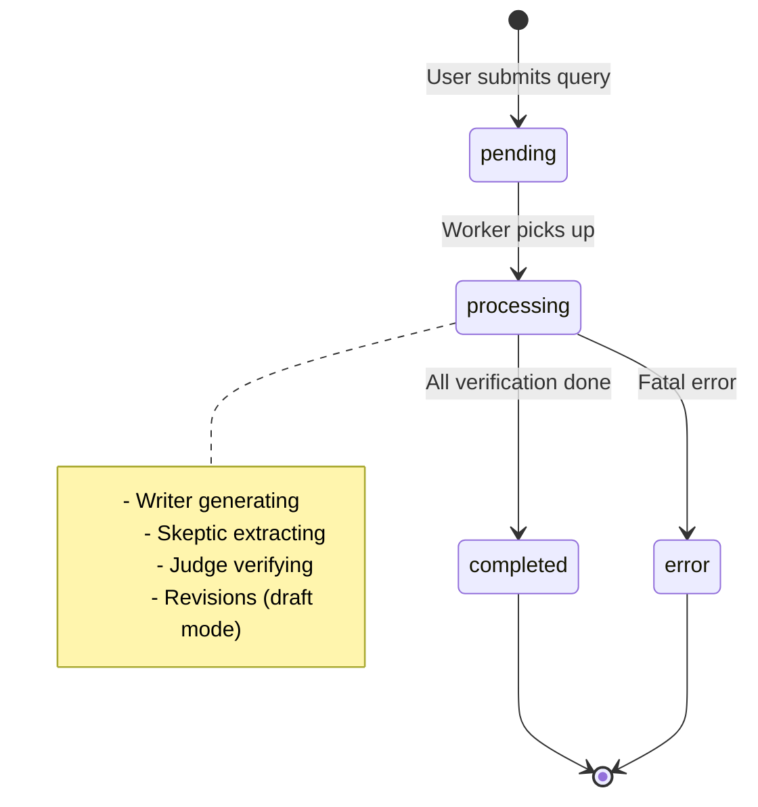
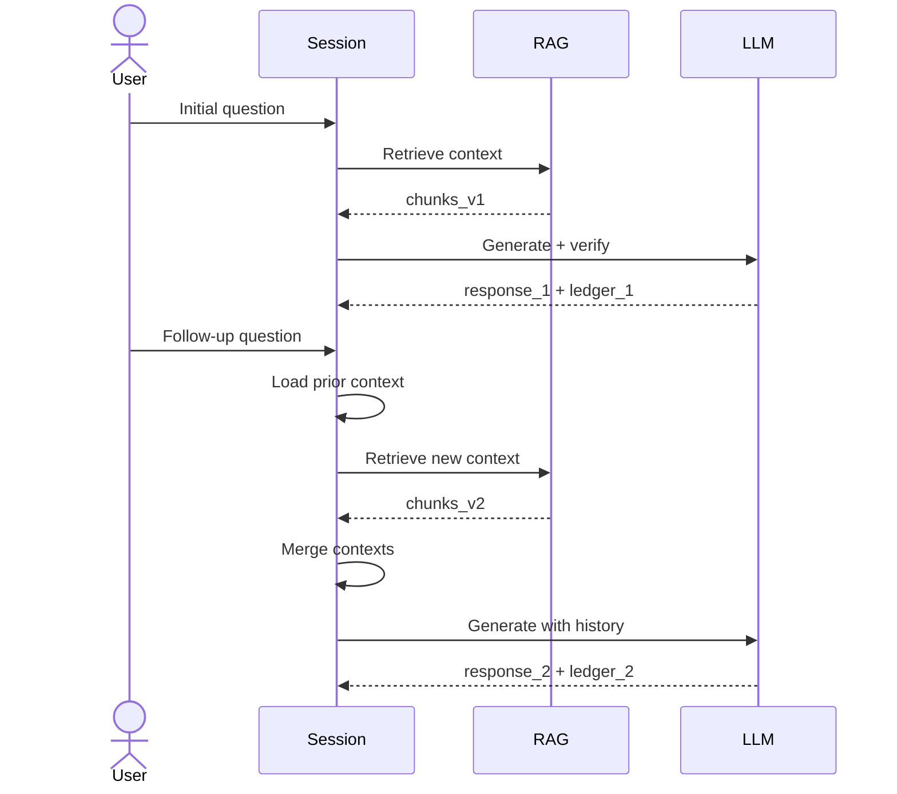

# Q&A and Drafting Workflows

> **Version:** 1.0
> **Last Updated:** 2026-01-03

---

## 1. Overview

VerityDraft supports two primary interaction modes:
- **Answer Mode**: Concise, verified answers to questions
- **Draft Mode**: Longer, citation-heavy documents with revision loops

---

## 2. Mode Comparison

| Aspect | Answer Mode | Draft Mode |
|--------|-------------|------------|
| Output length | Short (1-3 paragraphs) | Long (multi-page) |
| Citation density | Selective | Comprehensive |
| Revision cycles | 0-1 | 0-2 |
| Skeptic intensity | Light | Aggressive |
| Use case | Quick lookups | Report writing |

---

## 3. Answer Mode Workflow

### 3.1 Flow Diagram



### 3.2 Writer Prompt (Answer Mode)

```typescript
const answerModePrompt = `
You are a helpful research assistant with access to verified source documents.
Answer the user's question based ONLY on the provided context.

## Guidelines
1. Be concise and direct
2. Cite sources using [cite:CHUNK_ID] format
3. If information is not in the context, say "I don't have information about that in the documents"
4. Prefer specific quotes over paraphrasing
5. Do not speculate or add information beyond the sources

## Context
${formattedContext}

## Question
${userQuery}

## Answer
`;
```

### 3.3 Example Interaction

```
User: What is the maximum loan-to-value ratio for residential properties?

Writer Response:
According to the lending guidelines, the maximum loan-to-value (LTV)
ratio for residential properties is 80% for primary residences [cite:abc123]
and 75% for investment properties [cite:def456]. Higher LTV ratios up to
95% may be approved with private mortgage insurance [cite:abc123].

Evidence Ledger:
| Claim | Type | Verdict | Source |
|-------|------|---------|--------|
| Max LTV 80% for primary | numeric | supported | Policy Doc p.12 |
| Max LTV 75% for investment | numeric | supported | Policy Doc p.14 |
| 95% with PMI | policy | supported | Policy Doc p.12 |
```

---

## 4. Draft Mode Workflow

### 4.1 Flow Diagram



### 4.2 Writer Prompt (Draft Mode)

```typescript
const draftModePrompt = `
You are a professional document writer creating verified, citation-heavy content.
Generate a comprehensive draft based on the provided context.

## Requirements
1. Every factual claim MUST have a citation [cite:CHUNK_ID]
2. Use multiple sources to support key points
3. Structure with clear headings and sections
4. Maintain professional, formal tone
5. Explicitly note any gaps in source material

## Context
${formattedContext}

## Draft Request
${userPrompt}

## Draft
`;
```

### 4.3 Revision Prompt

```typescript
const revisionPrompt = `
Your previous draft had the following verification issues:

## Unsupported Claims
${unsupportedClaims.map(c => `- "${c.text}" (${c.verdict})`).join('\n')}

## Available Evidence
${availableEvidence.map(e => `- ${e.snippet} [${e.chunkId}]`).join('\n')}

## Instructions
1. Revise the draft to address unsupported claims
2. Either add citations from available evidence OR remove/soften claims
3. Do not invent citations
4. Maintain the overall structure and flow

## Revised Draft
`;
```

### 4.4 Revision Cycle Example



---

## 5. Verification Modes

### 5.1 Strict vs Helpful Mode



### 5.2 Mode Selection

| Use Case | Recommended Mode |
|----------|------------------|
| Legal documents | Strict |
| Financial reports | Strict |
| Internal summaries | Helpful |
| Research notes | Helpful |
| Regulatory filings | Strict |
| Marketing content | Helpful |

---

## 6. Context Management

### 6.1 Context Window Strategy

```typescript
interface ContextConfig {
  maxTokens: number;
  retrievalCount: number;
  rerankTopK: number;
}

const contextConfigs: Record<string, ContextConfig> = {
  answer: {
    maxTokens: 30000,
    retrievalCount: 10,
    rerankTopK: 6,
  },
  draft: {
    maxTokens: 50000,
    retrievalCount: 20,
    rerankTopK: 15,
  },
};
```

### 6.2 Context Assembly



---

## 7. Citation Handling

### 7.1 Citation Format

```typescript
// In-text citation format
const CITATION_PATTERN = /\[cite:([a-f0-9]{12})\]/g;

// Example in response
"The policy requires approval for amounts over $10,000 [cite:abc123def456]."

// Parsed citation
interface Citation {
  chunkId: string;      // "abc123def456"
  position: number;     // Character offset in response
  claimText: string;    // Associated claim text
}
```

### 7.2 Citation Resolution

```typescript
async function resolveCitations(
  response: string,
  workspaceId: string
): Promise<ResolvedCitation[]> {
  const citations = extractCitations(response);

  const chunks = await supabase
    .from('document_chunks')
    .select('chunk_hash, content, document_id, page_number')
    .in('chunk_hash', citations.map(c => c.chunkId));

  return citations.map(citation => {
    const chunk = chunks.find(c => c.chunk_hash === citation.chunkId);
    return {
      ...citation,
      content: chunk?.content,
      source: chunk?.document_id,
      pageNumber: chunk?.page_number,
    };
  });
}
```

---

## 8. Streaming Response

### 8.1 Stream Events

```typescript
type StreamEvent =
  | { type: 'session_created'; sessionId: string }
  | { type: 'content_chunk'; delta: string; fullContent: string }
  | { type: 'citation_detected'; citation: Citation }
  | { type: 'claim_extracted'; claim: Claim }
  | { type: 'claim_verified'; claimId: string; verdict: Verdict }
  | { type: 'ledger_updated'; ledger: EvidenceLedger }
  | { type: 'generation_complete'; summary: SessionSummary }
  | { type: 'error'; message: string; code: string };
```

### 8.2 Frontend Handling

```typescript
function useStreamingResponse(workspaceId: string) {
  const [state, dispatch] = useReducer(streamReducer, initialState);

  useEffect(() => {
    const ws = new WebSocket(`${WS_URL}?workspace=${workspaceId}`);

    ws.onmessage = (event) => {
      const message = JSON.parse(event.data);

      switch (message.type) {
        case 'content_chunk':
          dispatch({ type: 'APPEND_CONTENT', delta: message.delta });
          break;

        case 'claim_verified':
          dispatch({
            type: 'UPDATE_CLAIM',
            claimId: message.claimId,
            verdict: message.verdict,
          });
          break;

        case 'ledger_updated':
          dispatch({ type: 'SET_LEDGER', ledger: message.ledger });
          break;

        case 'generation_complete':
          dispatch({ type: 'COMPLETE', summary: message.summary });
          break;

        case 'error':
          dispatch({ type: 'ERROR', error: message.message });
          break;
      }
    };

    return () => ws.close();
  }, [workspaceId]);

  return state;
}
```

---

## 9. Session Management

### 9.1 Session Creation

```typescript
interface Session {
  id: string;
  workspaceId: string;
  userId: string;
  query: string;
  mode: 'answer' | 'draft';
  response?: string;
  ledger?: EvidenceLedger;
  status: 'pending' | 'processing' | 'completed' | 'error';
  metrics: SessionMetrics;
  createdAt: Date;
  completedAt?: Date;
}

interface SessionMetrics {
  processingTimeMs: number;
  tokenUsage: { writer: number; skeptic: number; judge: number };
  evidenceCoverage: number;
  unsupportedClaimCount: number;
  revisionCycles: number;
}
```

### 9.2 Session Lifecycle



---

## 10. Follow-up Questions

### 10.1 Context Preservation

```typescript
async function handleFollowUp(
  sessionId: string,
  followUpQuery: string
): Promise<void> {
  // Load previous context
  const session = await getSession(sessionId);
  const previousContext = await getSessionContext(sessionId);

  // Merge with new retrieval
  const newChunks = await retrieveChunks(followUpQuery, session.workspaceId);
  const mergedContext = mergeContexts(previousContext, newChunks);

  // Generate with conversation history
  const response = await generateWithHistory(
    session.messages,
    followUpQuery,
    mergedContext
  );

  // Append to session
  await appendToSession(sessionId, followUpQuery, response);
}
```

### 10.2 Conversation Flow



---

## 11. Export Functionality

### 11.1 Export Formats

| Format | Content | Use Case |
|--------|---------|----------|
| Markdown | Response + ledger table | Documentation |
| PDF | Formatted document | Formal sharing |
| JSON | Full structured data | API integration |
| DOCX | Editable document | Collaboration |

### 11.2 Export with Citations

```typescript
function exportToMarkdown(session: Session): string {
  const { response, ledger } = session;

  // Convert citations to footnotes
  let markdown = response.replace(
    /\[cite:([a-f0-9]{12})\]/g,
    (match, chunkId) => {
      const entry = ledger.entries.find(e => e.chunkIds.includes(chunkId));
      const footnoteNum = ledger.entries.indexOf(entry) + 1;
      return `[^${footnoteNum}]`;
    }
  );

  // Add footnotes section
  markdown += '\n\n---\n\n## Sources\n\n';
  ledger.entries.forEach((entry, i) => {
    markdown += `[^${i + 1}]: ${entry.evidenceSnippet?.slice(0, 100)}...\n`;
  });

  // Add ledger table
  markdown += '\n\n## Evidence Ledger\n\n';
  markdown += '| Claim | Verdict | Confidence |\n';
  markdown += '|-------|---------|------------|\n';
  ledger.entries.forEach(entry => {
    markdown += `| ${entry.claimText.slice(0, 50)}... | ${entry.verdict} | ${Math.round(entry.confidence * 100)}% |\n`;
  });

  return markdown;
}
```

---

## 12. Quality Metrics

### 12.1 Response Quality

| Metric | Formula | Target |
|--------|---------|--------|
| Evidence Coverage | supported_claims / total_claims | ≥ 85% |
| Citation Density | citations / paragraphs | ≥ 1.5 |
| Contradiction Rate | contradicted_claims / total_claims | ≤ 2% |
| Gap Rate | not_found_claims / total_claims | ≤ 5% |

### 12.2 Performance Metrics

| Metric | Target | Measurement |
|--------|--------|-------------|
| Time to First Token | < 500ms | Initial streaming delay |
| Total Response Time | < 15s (answer), < 60s (draft) | Query to complete |
| Verification Latency | < 200ms per claim | Judge processing time |
