# User Journeys

> **Version:** 1.0
> **Last Updated:** 2026-01-03

---

## 1. Overview

This document maps the end-to-end user flows through VerityDraft, from document upload to verified output export.

---

## 2. Journey Map

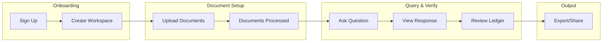

---

## 3. Document Upload Journey

### 3.1 Sequence Diagram

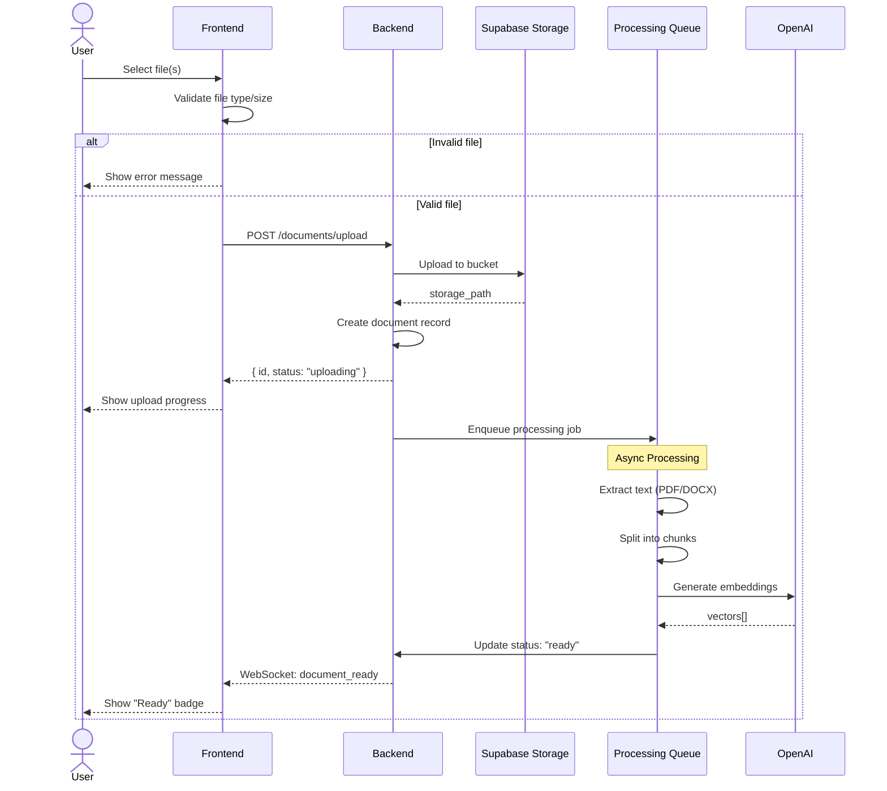

### 3.2 User Actions

| Step | Action | Feedback |
|------|--------|----------|
| 1 | Click "Upload Documents" | Upload zone appears |
| 2 | Drag & drop or browse files | Files validated |
| 3 | Wait for processing | Progress indicator |
| 4 | View processed document | "Ready" status shown |

### 3.3 Error Scenarios

| Error | User Sees | Recovery |
|-------|-----------|----------|
| File too large | "File exceeds 50MB limit" | Select smaller file |
| Invalid format | "Only PDF and DOCX supported" | Convert file |
| Processing failed | "Error processing document" | Retry or contact support |

---

## 4. Question & Answer Journey

### 4.1 Sequence Diagram

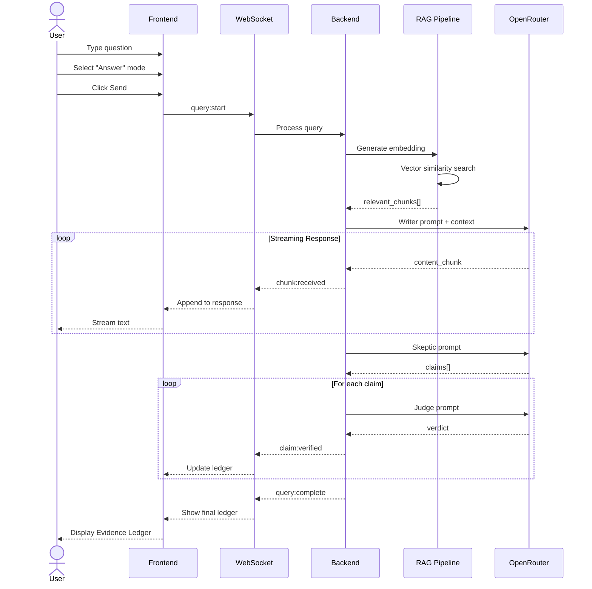

### 4.2 User Actions

| Step | Action | Feedback |
|------|--------|----------|
| 1 | Type question | Input field active |
| 2 | Select mode (Answer/Draft) | Toggle highlights |
| 3 | Click Send | Loading indicator |
| 4 | Watch response stream | Text appears progressively |
| 5 | View citations | Numbered anchors in text |
| 6 | Check Evidence Ledger | Panel updates with verdicts |

### 4.3 Evidence Ledger Interaction

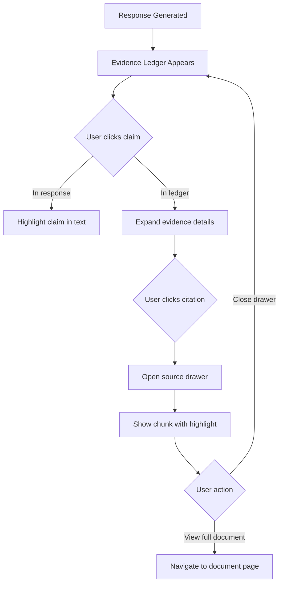

---

## 5. Draft Generation Journey

### 5.1 Sequence Diagram

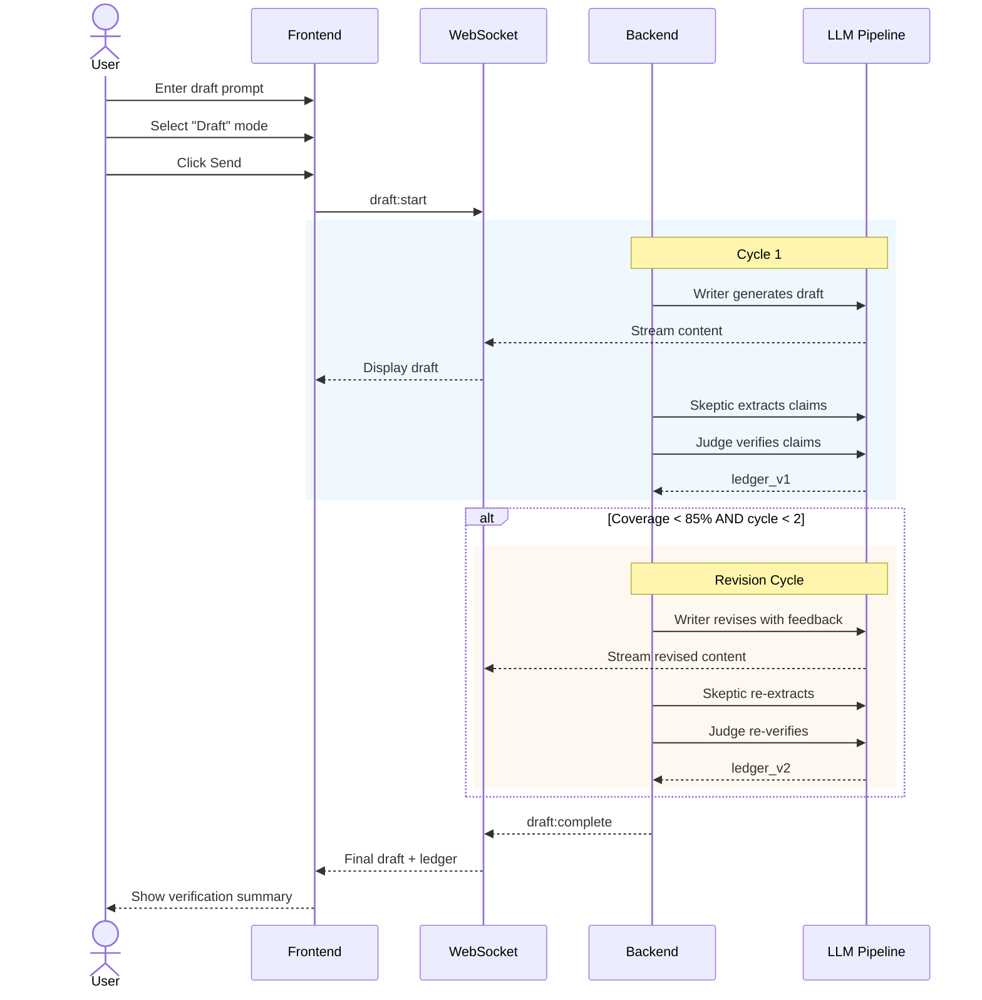

### 5.2 Revision Flow

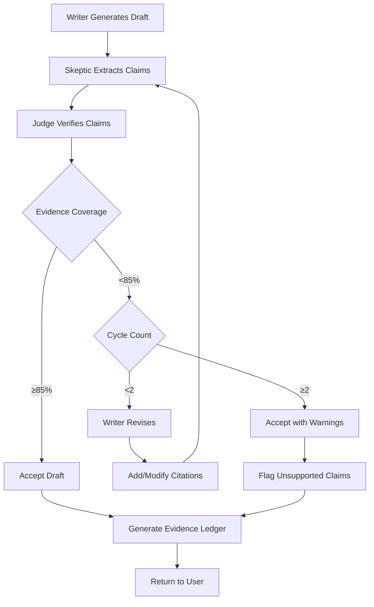

### 5.3 User Actions

| Step | Action | Feedback |
|------|--------|----------|
| 1 | Describe draft requirements | Input validated |
| 2 | Select Draft mode | Toggle switches |
| 3 | Click Generate | "Generating..." indicator |
| 4 | Watch draft stream | Text appears with citations |
| 5 | Review revision cycle | Progress: "Verifying claims..." |
| 6 | Examine final ledger | Coverage score displayed |
| 7 | Download/copy draft | Export options available |

---

## 6. Evidence Ledger Review Journey

### 6.1 Interaction Flow

```mermaid
flowchart TD
    A[View Response with Ledger] --> B{User Goal}

    B -->|Verify claim| C[Click claim row]
    C --> D[View evidence snippet]
    D --> E[Click "View source"]
    E --> F[Document viewer opens]
    F --> G[Highlighted chunk visible]

    B -->|Check coverage| H[View summary stats]
    H --> I[See % by verdict type]

    B -->|Flag issue| J[Click "Report Issue"]
    J --> K[Select issue type]
    K --> L[Submit feedback]

    B -->|Export| M[Click Export]
    M --> N{Format selection}
    N -->|Markdown| O[Download .md]
    N -->|PDF| P[Download .pdf]
    N -->|JSON| Q[Download .json]
```

### 6.2 Ledger Panel States

| State | Display | User Action |
|-------|---------|-------------|
| Loading | Skeleton rows | Wait |
| Populated | Sorted claim list | Click rows |
| Expanded | Claim + evidence | View sources |
| Highlighted | Active claim | See in response |

---

## 7. Session History Journey

### 7.1 Sequence Diagram

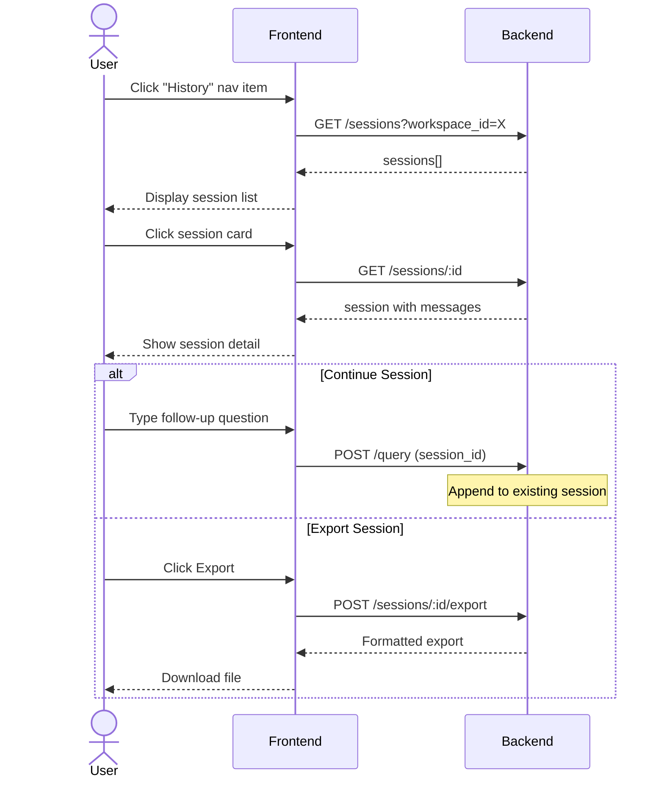

### 7.2 User Actions

| Step | Action | Feedback |
|------|--------|----------|
| 1 | Navigate to History | Session list loads |
| 2 | Filter/search sessions | Results update |
| 3 | Click session | Full conversation loads |
| 4 | Review past ledgers | Expandable per-message |
| 5 | Continue or export | Actions available |

---

## 8. Export Journey

### 8.1 Sequence Diagram

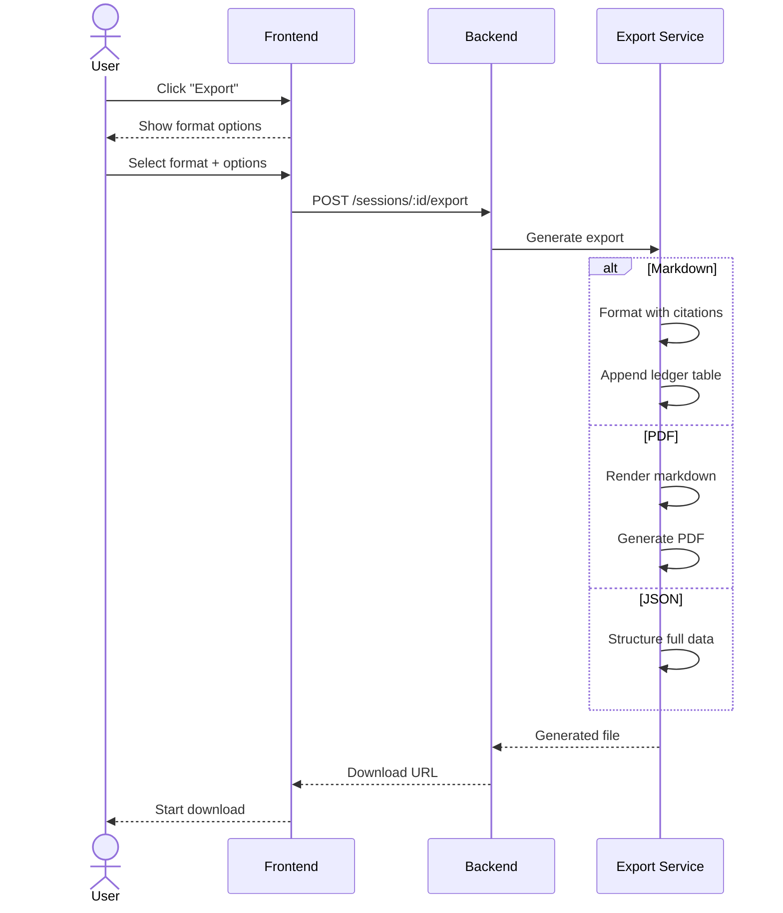

### 8.2 Export Options

| Format | Includes | Use Case |
|--------|----------|----------|
| Markdown | Response + ledger table | Documentation |
| PDF | Formatted document | Sharing |
| JSON | Full structured data | Integration |

---

## 9. Workspace Management Journey

### 9.1 Create Workspace

```mermaid
flowchart TD
    A[Click "New Workspace"] --> B[Enter name]
    B --> C[Configure settings]
    C --> D[Click Create]
    D --> E[Workspace created]
    E --> F[Redirect to workspace home]
    F --> G[Prompt to upload documents]
```

### 9.2 Invite Members

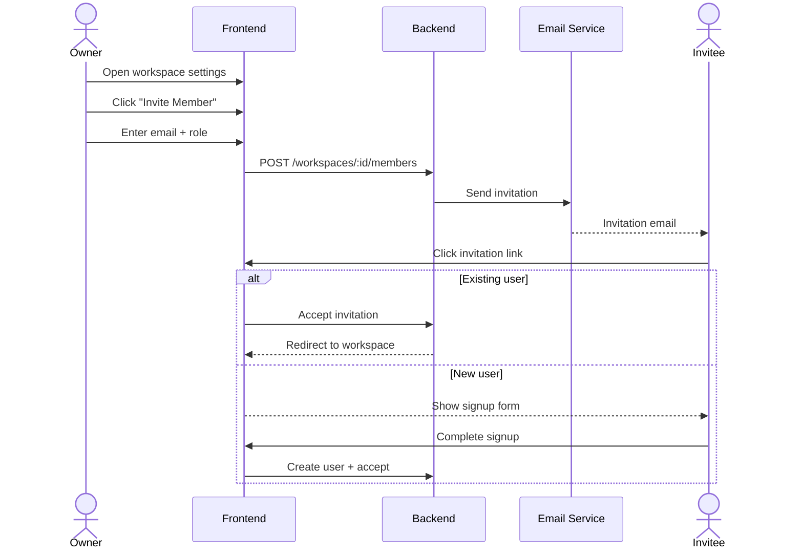

---

## 10. Mobile User Journey

### 10.1 Responsive Adaptations

| Screen Size | Sidebar | Ledger Panel | Document Viewer |
|-------------|---------|--------------|-----------------|
| Desktop (>1024px) | Fixed visible | Side panel | Split view |
| Tablet (768-1024px) | Collapsible | Bottom sheet | Modal |
| Mobile (<768px) | Drawer | Full screen | Full screen |

### 10.2 Touch Interactions

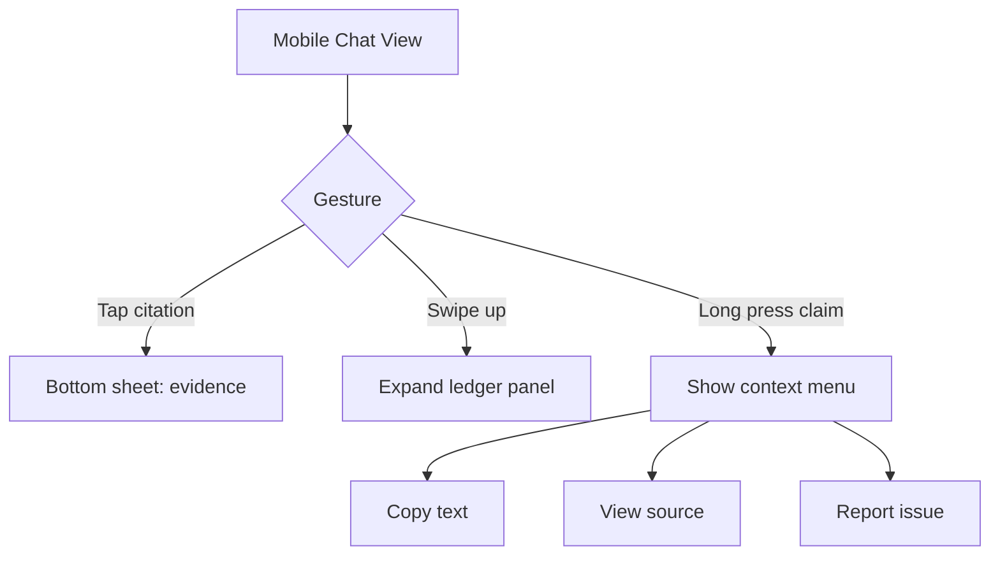

---

## 11. Error Recovery Journeys

### 11.1 Network Failure

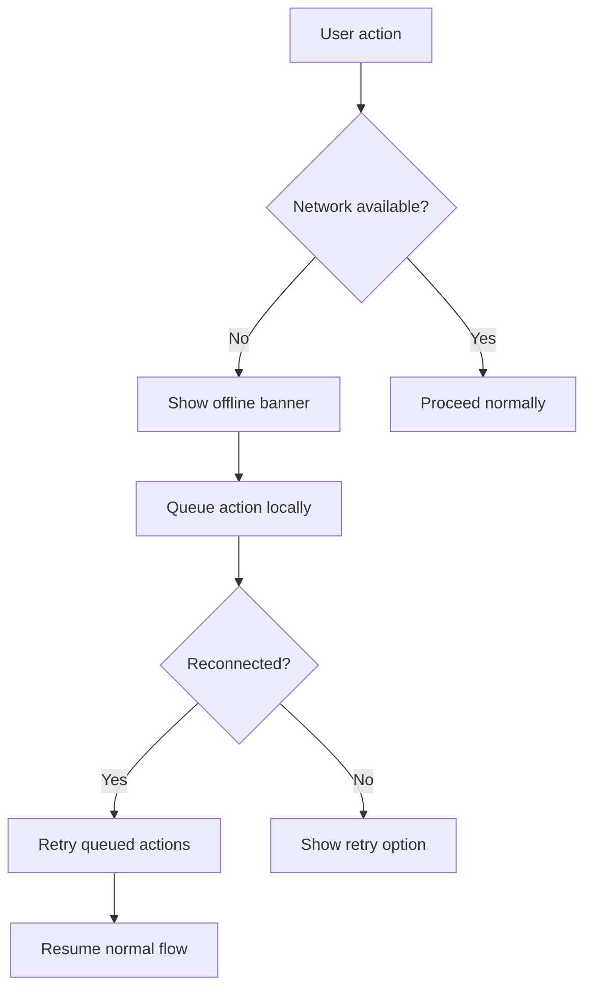

### 11.2 LLM Failure

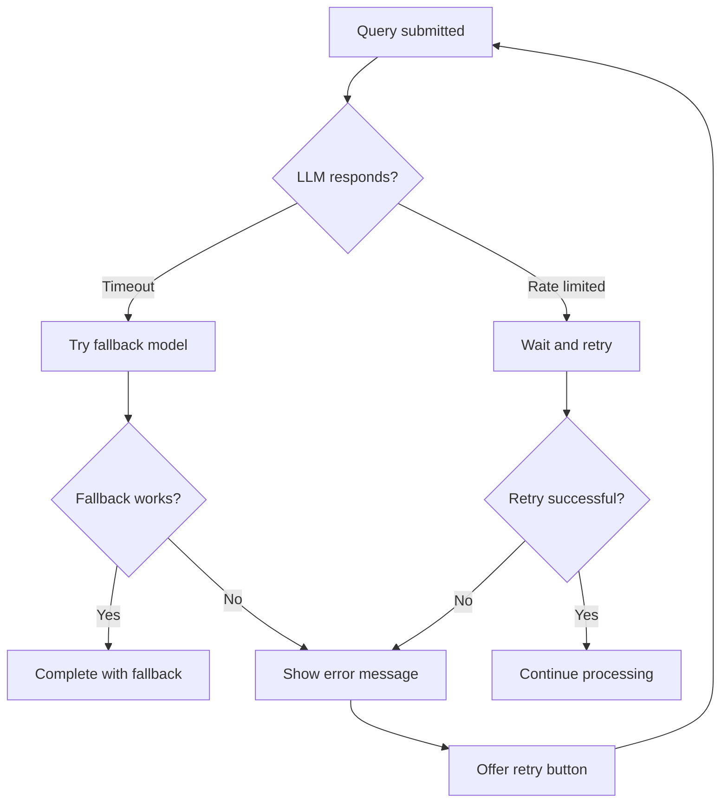
