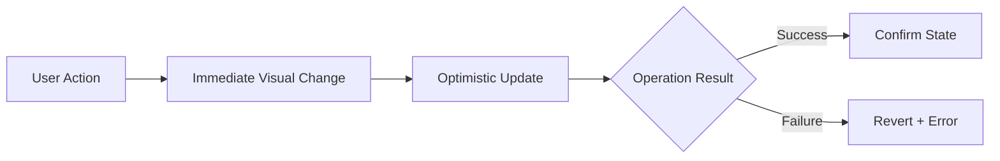

# Design Principles

> **Version:** 1.0
> **Last Updated:** 2026-01-03

---

## 1. Core Philosophy

VerityDraft's design philosophy centers on **Trust through Transparency**. Every design decision should reinforce the user's confidence in the verification system by making evidence visible, accessible, and understandable.

---

## 2. Guiding Principles

### 2.1 Evidence-Forward Design

> **Make the evidence trail the hero of every interaction.**

The source of truth should never be hidden. Users should always be one click away from the underlying evidence for any claim.

**Do:**
- Display citation anchors inline with content
- Show evidence snippets on hover/click
- Provide direct links to source documents

**Don't:**
- Hide citations behind multiple clicks
- Show claims without visible evidence links
- Use generic "source" labels without specifics

```
✓ Good: "Revenue increased 15% [1]" with expandable source
✗ Bad: "Revenue increased 15%" with no citation visible
```

---

### 2.2 Uncertainty is Visible

> **Never disguise doubt as confidence.**

The verification system produces nuanced verdicts. The UI must clearly communicate the difference between "supported," "weak," and "not found."

**Do:**
- Use distinct visual treatments for each verdict type
- Show confidence scores alongside verdicts
- Highlight unsupported claims prominently

**Don't:**
- Use ambiguous color coding
- Collapse verdict nuance into binary indicators
- Hide low-confidence results

```
✓ Good: Yellow badge for "Weak" with 65% confidence shown
✗ Bad: Gray badge for anything less than "Supported"
```

---

### 2.3 Professional Clarity

> **Designed for knowledge workers, not casual browsers.**

VerityDraft is a professional tool for users who deal with complex documents. The design should be clean, information-dense, and efficient.

**Do:**
- Prioritize information density over whitespace
- Use clear typography hierarchies
- Enable keyboard navigation for power users

**Don't:**
- Over-simplify at the cost of utility
- Add decorative elements that don't serve function
- Force linear workflows when parallel actions are possible

---

### 2.4 Progressive Disclosure

> **Show what's needed, when it's needed.**

Complex information should unfold progressively. Start with summaries, allow drilling into details.

**Do:**
- Show summary metrics at a glance (e.g., "85% coverage")
- Enable expansion for full claim-by-claim breakdown
- Layer information from overview to detail

**Don't:**
- Dump all information at once
- Require context switching to see related details
- Hide critical warnings behind extra clicks

---

### 2.5 Contextual Actions

> **Actions should appear where they're relevant.**

User actions should be discoverable at the point of need, not buried in global menus.

**Do:**
- Show export options near completed responses
- Place feedback controls on individual claims
- Enable quick actions on hover/focus

**Don't:**
- Centralize all actions in a toolbar
- Require navigation to perform common tasks
- Hide frequently-used actions in menus

---

## 3. Visual Hierarchy

### 3.1 Information Layers

```
┌─────────────────────────────────────────────────────────┐
│  LAYER 1: Navigation & Context                          │
│  ┌─────────────────────────────────────────────────────┐│
│  │  LAYER 2: Primary Content (Response/Document)       ││
│  │  ┌─────────────────────────────────────────────────┐││
│  │  │  LAYER 3: Evidence Details (Citations/Sources)  │││
│  │  │  ┌─────────────────────────────────────────────┐│││
│  │  │  │  LAYER 4: Meta Information (Timestamps)     ││││
│  │  │  └─────────────────────────────────────────────┘│││
│  │  └─────────────────────────────────────────────────┘││
│  └─────────────────────────────────────────────────────┘│
└─────────────────────────────────────────────────────────┘
```

### 3.2 Attention Priorities

| Priority | Elements | Treatment |
|----------|----------|-----------|
| 1 (Highest) | Active content, errors, warnings | Bold, high contrast, color |
| 2 | Response text, claim list | Regular weight, black text |
| 3 | Citations, verdicts | Colored badges, smaller text |
| 4 (Lowest) | Timestamps, metadata | Gray text, smallest size |

---

## 4. Interaction Principles

### 4.1 Immediate Feedback

Every user action should produce immediate visual feedback, even if the underlying operation takes time.



### 4.2 Streaming Responses

The AI generates content progressively. The UI should embrace this:

- Show text as it arrives (typewriter effect optional)
- Display "Verifying claims..." indicator during processing
- Update the Evidence Ledger in real-time as claims are verified

### 4.3 Graceful Degradation

When parts of the system fail, the UI should:

1. Continue showing available information
2. Clearly indicate what's unavailable
3. Offer retry options where appropriate

---

## 5. Accessibility Principles

### 5.1 WCAG 2.1 AA Compliance

| Criterion | Implementation |
|-----------|----------------|
| Color contrast | Minimum 4.5:1 for text, 3:1 for UI |
| Focus indicators | Visible 2px outline on all interactive |
| Screen readers | ARIA labels on all custom components |
| Keyboard navigation | Tab order follows visual hierarchy |

### 5.2 Color Blindness Considerations

Verdicts use color + shape + text to ensure distinction:

| Verdict | Color | Icon | Text |
|---------|-------|------|------|
| Supported | Green | ✓ | "Supported" |
| Weak | Amber | ⚠ | "Weak" |
| Contradicted | Red | ✗ | "Contradicted" |
| Not Found | Gray | ? | "Not Found" |

### 5.3 Motion Sensitivity

- Respect `prefers-reduced-motion` media query
- Provide static alternatives to animations
- Keep essential animations brief (< 300ms)

---

## 6. Responsive Design Principles

### 6.1 Breakpoint Strategy

| Breakpoint | Layout Adaptation |
|------------|-------------------|
| Desktop (>1024px) | Full three-column layout |
| Tablet (768-1024px) | Collapsible sidebar, stacked panels |
| Mobile (<768px) | Single column, bottom sheets |

### 6.2 Content Priority (Mobile)

When space is constrained, prioritize:

1. Current response/query
2. Summary metrics (coverage score)
3. Critical warnings
4. Expandable ledger details
5. Navigation

### 6.3 Touch Targets

- Minimum 44x44px for interactive elements
- Adequate spacing between touch targets (8px minimum)
- Swipe gestures for common actions (dismiss, expand)

---

## 7. Error State Principles

### 7.1 Error Communication

| Severity | Visual Treatment | User Action |
|----------|------------------|-------------|
| Critical | Red banner, blocks progress | Must resolve |
| Warning | Yellow inline, continues | Should address |
| Info | Blue subtle, informational | Optional |

### 7.2 Error Messages

Good error messages are:
- **Specific**: What exactly went wrong
- **Actionable**: What the user can do
- **Human**: No technical jargon

```
✓ Good: "Couldn't process this PDF. It may be password-protected. Try uploading an unlocked version."

✗ Bad: "Error: EXTRACTION_FAILED (code: 0x8004)"
```

---

## 8. Loading State Principles

### 8.1 Loading Indicators

| Duration | Treatment |
|----------|-----------|
| < 300ms | No indicator (feels instant) |
| 300ms - 2s | Subtle spinner or skeleton |
| 2s - 10s | Progress indicator with context |
| > 10s | Progress + estimated time + cancel option |

### 8.2 Skeleton Screens

Use skeleton screens that match the expected content layout:

```
┌─────────────────────────────────────┐
│ ████████████████████                │  ← Title skeleton
│ ██████████████████████████████████  │  ← Content line 1
│ ████████████████████████████        │  ← Content line 2
│                                     │
│ ┌─────┐ ┌─────┐ ┌─────┐             │  ← Metric skeletons
│ │ ███ │ │ ███ │ │ ███ │             │
│ └─────┘ └─────┘ └─────┘             │
└─────────────────────────────────────┘
```

---

## 9. Empty State Principles

Empty states should:

1. Explain what will appear here
2. Guide the user to the first action
3. Feel welcoming, not broken

```
┌─────────────────────────────────────┐
│                                     │
│           📄                        │
│    No documents yet                 │
│                                     │
│    Upload your first document       │
│    to start asking questions        │
│                                     │
│    ┌─────────────────────┐          │
│    │   Upload Document   │          │
│    └─────────────────────┘          │
└─────────────────────────────────────┘
```

---

## 10. Performance Perception

### 10.1 Perceived Speed Techniques

| Technique | Application |
|-----------|-------------|
| Optimistic updates | Show action result before confirmation |
| Progressive loading | Display partial content immediately |
| Preloading | Fetch likely next actions in background |
| Animations | Use motion to mask loading time |

### 10.2 Performance Budgets

| Metric | Target |
|--------|--------|
| First Contentful Paint | < 1.5s |
| Time to Interactive | < 3s |
| Largest Contentful Paint | < 2.5s |
| Cumulative Layout Shift | < 0.1 |
