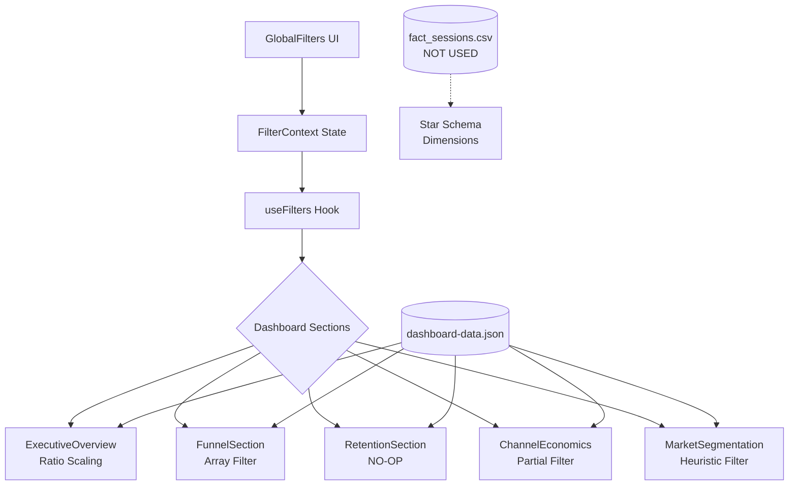

# Research: Critical Gaps in Global Filters Implementation

**Date**: 2025-12-20T20:51:59+05:30  
**Researcher**: biswajitmondal  
**Git Commit**: 44f032dbfbc118e8874032d37532580b280389d9  
**Branch**: feature/project3-and-chart-updates  
**Repository**: Resume_Projects

## Research Question

Identify critical gaps in the Global Filters component of the India Acquisition Funnel Dashboard (Project_1), analyzing the filter state management, data integration patterns, and user experience implementation across all dashboard sections.

## Summary

The Global Filters implementation presents a well-designed UI with neo-brutalist styling but contains **significant functional gaps** that undermine data accuracy and analytical validity. The filter infrastructure uses React Context for state management across three filter dimensions (Marketing Channel, Device Type, User Type), but the data layer integrations are inconsistent across dashboard components—with some sections completely ignoring filter selections. The most critical finding is that the Retention Section's filter implementation is a **no-op** (always returns `true`), and the overall system uses **ratio-based approximations** rather than actual data filtering against the star schema.

---

## Detailed Findings

### Component/Area 1: Filter State Management Architecture

The filter state is properly architected using React Context pattern:

**File**: [`FilterContext.tsx`](https://github.com/sciencenerd-des/Resume_Projects/blob/44f032dbfbc118e8874032d37532580b280389d9/Project_1/src/components/dashboard/FilterContext.tsx)

```typescript
// Lines 3-7: Filter State Interface
export interface FilterState {
  selectedChannels: number[];
  selectedDevices: number[];
  userType: "all" | "new" | "returning";
}
```

**Current Implementation**:
- State managed via `useState` hooks (lines 29-31)
- Provides `resetFilters()` utility function
- Exposes `isFiltered` boolean for UI feedback
- Exports `DEFAULT_CHANNELS` (0-5) and `DEFAULT_DEVICES` (0-2)

**How it connects**: `FilterProvider` wraps the entire dashboard in [`DashboardLayout.tsx:3`](https://github.com/sciencenerd-des/Resume_Projects/blob/44f032dbfbc118e8874032d37532580b280389d9/Project_1/src/components/dashboard/DashboardLayout.tsx), making filter state available to all child components via the `useFilters()` hook.

---

### Component/Area 2: Global Filters UI Component

**File**: [`GlobalFilters.tsx`](https://github.com/sciencenerd-des/Resume_Projects/blob/44f032dbfbc118e8874032d37532580b280389d9/Project_1/src/components/dashboard/GlobalFilters.tsx)

**Current Implementation**:
- Three filter groups: Marketing Channel (6 options), Device Type (3 options), User Type (3 options)
- Toggle behavior with minimum 1 selection requirement (lines 40-46)
- Neo-brutalist styling with `shadow-brutal-xs` and `border-2`
- Visual "Active" badge when filters differ from defaults

**Labels Configuration**:
```typescript
// Lines 6-19: Static label mappings
const CHANNEL_LABELS: Record<number, string> = {
  0: "Channel 0", 1: "Channel 1", 2: "Channel 2",
  3: "Channel 3", 4: "Channel 4", 5: "Channel 5",
};
const DEVICE_LABELS: Record<number, string> = {
  0: "Desktop", 1: "Mobile", 2: "Tablet",
};
```

---

### Component/Area 3: Data Integration Patterns (Per Section)

#### 3.1 Executive Overview (`ExecutiveOverview.tsx`)
**Lines 41-97**: Implements **ratio-based scaling** rather than actual filtering:

```typescript
// Lines 56-58: Calculates proportion ratios
const channelSessionsRatio = allChannelSessions > 0 
  ? selectedChannelSessions / allChannelSessions : 1;
```

The component scales monthly series data proportionally based on selected filter ratios. This preserves trend shapes but does **not** filter actual session-level data.

#### 3.2 Funnel Section (`FunnelSection.tsx`)
**Lines 15-21**: Uses direct array filtering on `data.channels` and `data.devices`:

```typescript
const filteredChannels = data.channels.filter(channel =>
  selectedChannels.includes(channel.channelId)
);
```

**User Type handling (Lines 35-40)**: Hardcoded logic that sets `newCustomers` to 0 for "returning" users—an approximation, not data-derived.

#### 3.3 Retention Section (`RetentionSection.tsx`)
**Lines 20-25**: **CRITICAL NO-OP FILTER**:

```typescript
const filteredMatrix = data.retention.matrix.filter(row => {
  // This is a simplified approach since retention data doesn't have 
  // direct channel/device associations
  return true; // ← Always returns true, filter has ZERO effect
});
```

User type filter (lines 27-35) also has no practical effect as all conditions return `true`.

#### 3.4 Channel Economics (`ChannelEconomicsSection.tsx`)
**Lines 20-22**: Properly filters channels array:

```typescript
const filteredChannels = data.channels.filter(channel =>
  selectedChannels.includes(channel.channelId)
);
```

**Gap**: Does not use `selectedDevices` or `userType` filters at all.

#### 3.5 Market Segmentation (`MarketSegmentationSection.tsx`)
**Lines 22-31**: Uses **heuristic-based filtering** for phone usage data:

```typescript
const filteredScreenVsSpend = data.phoneUsage.screenVsSpend.filter(point => {
  if (selectedDevices.includes(1) && point.os === "iOS") return true;
  if (selectedDevices.includes(1) && point.os === "Android") return true;
  if (selectedDevices.includes(0)) return true; // Desktop shows all
  if (selectedDevices.includes(2)) return true; // Tablet shows all
  return false;
});
```

**Lines 42-45**: User type filter uses **magic numbers**:
```typescript
users: userType === "all" ? bucket.users 
  : Math.floor(bucket.users * (userType === "new" ? 0.3 : 0.7))
```

---

### Component/Area 4: Data Layer Architecture

**File**: [`data/index.ts`](https://github.com/sciencenerd-des/Resume_Projects/blob/44f032dbfbc118e8874032d37532580b280389d9/Project_1/src/data/index.ts)

```typescript
import rawDashboardData from "./dashboard-data.json";
const dashboardData = rawDashboardData as DashboardData;
export const staticDashboardData: DashboardData = dashboardData;
```

**Finding**: The dashboard loads **pre-aggregated JSON** rather than filtering raw CSV data from the star schema. The actual session-level data exists in:

**File**: [`processed/fact_sessions.csv`](https://github.com/sciencenerd-des/Resume_Projects/blob/44f032dbfbc118e8874032d37532580b280389d9/Project_1/processed/fact_sessions.csv)

This CSV contains columns for `marketing_channel_id`, `device_type_id`, and `user_type` that would enable proper client-side filtering—but these are not utilized.

---

### Component/Area 5: Accessibility Implementation

**File**: `GlobalFilters.tsx` (lines 87-98)

**Current HTML**:
```html
<button
  key={id}
  onClick={() => toggleChannel(id)}
  className={`px-2.5 py-1 text-xs font-semibold...`}
>
  {CHANNEL_LABELS[id]}
</button>
```

**Missing Accessibility Attributes**:
- No `aria-pressed` to indicate toggle state
- No `role="group"` on button containers
- No `aria-label` for screen reader context
- No `aria-live` region for filter change announcements

---

## Code References

| File | Lines | Description |
|------|-------|-------------|
| `FilterContext.tsx` | 3-7 | FilterState interface definition |
| `FilterContext.tsx` | 28-37 | FilterProvider state management |
| `FilterContext.tsx` | 62-67 | useFilters hook implementation |
| `GlobalFilters.tsx` | 6-25 | Static label configurations |
| `GlobalFilters.tsx` | 39-57 | Toggle handlers with min-1 logic |
| `ExecutiveOverview.tsx` | 41-97 | Ratio-based filter scaling |
| `FunnelSection.tsx` | 15-21 | Direct array filtering |
| `RetentionSection.tsx` | 20-25 | **No-op filter (critical)** |
| `ChannelEconomicsSection.tsx` | 20-22 | Partial filter implementation |
| `MarketSegmentationSection.tsx` | 42-45 | Magic number user scaling |
| `data/index.ts` | 1-7 | Static JSON data loading |

---

## Architecture Documentation

### Filter Integration Pattern Comparison

| Component | Channel Filter | Device Filter | User Type Filter | Pattern Used |
|-----------|---------------|---------------|------------------|--------------|
| ExecutiveOverview | ✅ | ✅ | ⚠️ Partial | Ratio scaling |
| FunnelSection | ✅ | ✅ | ⚠️ Hardcoded | Array filter |
| RetentionSection | ❌ No-op | ❌ No-op | ❌ No-op | Always true |
| ChannelEconomics | ✅ | ❌ Unused | ❌ Unused | Array filter |
| MarketSegmentation | ❌ | ⚠️ Heuristic | ⚠️ Magic numbers | Mixed |

### Data Flow Diagram



---

## Gap Summary Table

| # | Gap | Severity | Location | Evidence |
|---|-----|----------|----------|----------|
| 1 | Data layer uses static JSON, not star schema | Critical | `data/index.ts` | Imports JSON instead of CSV |
| 2 | Retention filter is no-op | Critical | `RetentionSection.tsx:24` | `return true` |
| 3 | Inconsistent filter logic across 5 components | High | All sections | Pattern comparison table |
| 4 | User type uses magic 0.3/0.7 numbers | High | `MarketSegmentationSection.tsx:44` | Hardcoded values |
| 5 | No filter persistence (URL/localStorage) | Medium | `FilterContext.tsx` | useState only |
| 6 | Missing ARIA attributes | Medium | `GlobalFilters.tsx:87` | No aria-pressed |
| 7 | No empty state feedback | Medium | All sections | No conditionals |
| 8 | Generic channel labels | Low | `GlobalFilters.tsx:6` | "Channel 0-5" |

---

## Related Research

- No prior research documents found in `thoughts/shared/research/`

---

## Open Questions

1. **Should filters query fact_sessions.csv client-side or require a backend API?**
   - Client-side: ~80KB CSV could be filtered with Papaparse
   - Server-side: Would require Node/Python endpoint

2. **How should retention cohorts handle channel/device attribution?**
   - Option A: Join with `dim_customer` to get acquisition channel per cohort
   - Option B: Add `marketing_channel_id` to cohort aggregation

3. **What are the business definitions for "New" vs "Returning" user thresholds?**
   - Current data has `user_type` (0/1) in fact_sessions but unclear definition
